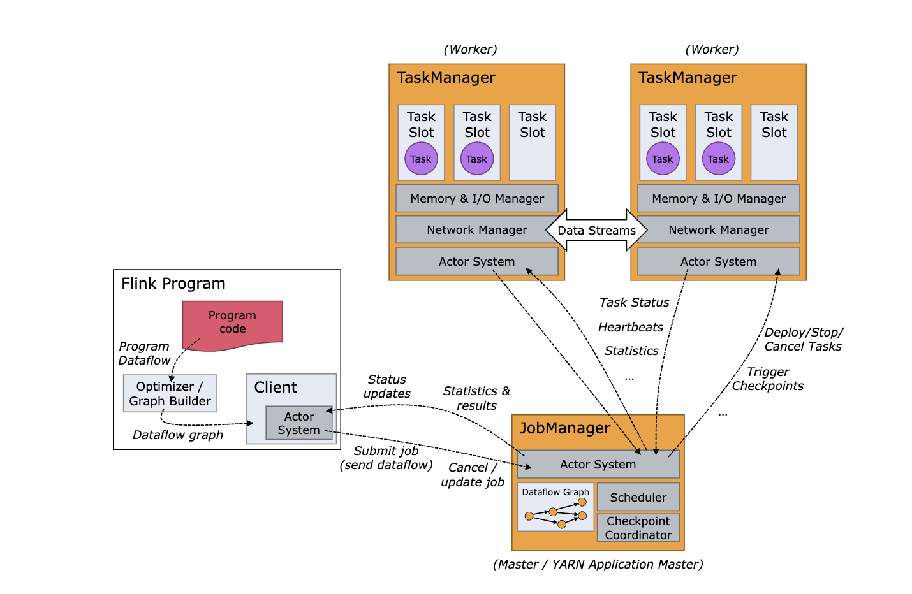

# Flink Arch
- [Flink Arch](#flink-arch)
  - [JobManager \& TaskManager](#jobmanager--taskmanager)
  - [Flink 高可用](#flink-高可用)
    - [如何启用集群高可用](#如何启用集群高可用)
    - [Flink 高可用服务](#flink-高可用服务)
    - [高可用数据生命周期](#高可用数据生命周期)

## JobManager & TaskManager
Flink 的运行时架构中，最重要的就是两大组件: 作业管理器（JobManger）和任务管理器（TaskManager）。

对于一个提交执行的作业，JobManager 是真正意义上的"管理者"（Master），负责管理调度，所以在不考虑高可用的情况下只能有一个；

而 TaskManager 是"工作者"（Worker、Slave），负责执行任务处理数据，所以可以有一个或多个。

- JobManager
  - JobManager 也称为 Master ，用于协调分布式任务执行。用来调度 Task 进行具体的任务。
  - JobManager 负责接收 Flink 程序，协调检查点，协调来自 TaskManager 的状态报告，协调失败恢复，协调对 JobManager 的查询，以及与外部资源交互。
  - JobManager 由三个不同的组件组成: ResourceManager、Dispatcher 和每个正在运行作业的 JobMaster。 
    - ResourceManager 负责 Flink 集群中的资源提供、回收、分配，它管理 task slots，这是 Flink 集群中资源调度的单位。
    - Dispatcher 提供了一个 REST 接口，用来提交 Flink 应用程序执行，并为每个提交的作业启动一个新的 JobMaster。它还运行 Flink WebUI 用来提供作业执行信息。
    - JobMaster 负责管理单个 JobGraph 的执行。Flink 集群中可以同时运行多个作业，每个作业都有自己的 JobMaster。
  - 始终至少有一个 JobManager。高可用（HA）设置中可能有多个 JobManager，其中一个始终是 leader，其他的则是 standby。
- TaskManager
  - TaskManager 也称为 Slave，负责执行 Task。
  - TaskManager 负责执行 Task，即执行 TaskManager 上的 Task。
  - TaskManager 由 TaskSlot 组成，TaskSlot 是 TaskManager 资源的一个子集，也是 Flink 资源管理的基本单位，Slot 的概念贯穿资源调度过程的始终。
  - 必须始终至少有一个 TaskManager。在 TaskManager 中资源调度的最小单位是 task slot。TaskManager 中 task slot 的数量表示并发处理 task 的数量。请注意一个 task slot 中可以执行多个算子。

## Flink 高可用

默认情况下，每个 Flink 集群只有一个 JobManager 实例。这会导致 单点故障（SPOF）: 如果 JobManager 崩溃，则不能提交任何新程序，运行中的程序也会失败。

使用 JobManager 高可用模式，你可以从 JobManager 失败中恢复，从而消除单点故障。

### 如何启用集群高可用
JobManager 高可用是指，在任何时候都有一个 JobManager Leader，如果 Leader 出现故障，则有多个备用 JobManager 来接管领导。这解决了单点故障问题，只要有备用 JobManager 担任领导者，程序就可以继续运行。

Flink 的 高可用服务 封装了所需的服务，使一切可以正常工作: 

- 领导者选举: 从 n 个候选者中选出一个领导者
- 服务发现: 检索当前领导者的地址
- 状态持久化: 继承程序恢复作业所需的持久化状态（JobGraphs、用户代码 jar、已完成的检查点）

### Flink 高可用服务
Flink 提供了两种高可用服务实现

- ZooKeeper: 每个 Flink 集群部署都可以使用 ZooKeeper HA 服务。它们需要一个运行的 ZooKeeper 复制组（quorum）。
- Kubernetes: Kubernetes HA 服务只能运行在 Kubernetes 上。

### 高可用数据生命周期
为了恢复提交的作业，Flink 持久化元数据和 job 组件。高可用数据将一直保存，直到相应的作业执行成功、被取消或最终失败。当这些情况发生时，将删除所有高可用数据，包括存储在高可用服务中的元数据。

