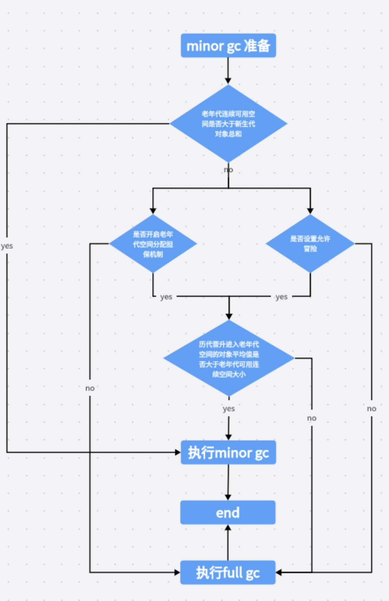

# Optimize
- [Optimize](#optimize)
  - [JVM 运行情况预估](#jvm-运行情况预估)
    - [年轻代对象增长的速率](#年轻代对象增长的速率)
    - [Young GC 的出发频率和每次耗时](#young-gc-的出发频率和每次耗时)
    - [每次 Young GC 后有多少对象存活和进入老年代](#每次-young-gc-后有多少对象存活和进入老年代)
    - [Full GC 触发频率和每次耗时](#full-gc-触发频率和每次耗时)
    - [优化思路](#优化思路)
    - [如果 Full GC 比 Minor GC 还多](#如果-full-gc-比-minor-gc-还多)
      - [老年代空间分配担保机制](#老年代空间分配担保机制)

## JVM 运行情况预估
用 `jstat -gc pid` 可以计算出一些关键数据，有了这些数据就可以采用之前介绍过的优化思路，先给自己的系统设计一些初始 JVM 参数，比如堆内存大小，年轻代大小， Eden 和 Survivor 的比例，老年代的大小，大对象的阈值，大龄对象进入老年代的阈值等。

### 年轻代对象增长的速率
使用 `jstat -gc pid 1000 10` 每隔 1s 执行一次命令，一共执行 10次。通过观察 EU(Eden Usage, Eden区的使用情况) 来估算每秒新增多少对象，如果系统负载不高，可以把频率 1s 换成 1min，甚至 10min 来观察整体情况。

注意，一般系统可能有高峰期和日常期，所以需要在不同的时间分别估算不同情况下对象增长速率。

### Young GC 的出发频率和每次耗时
知道年轻代对象的增长速率我们就能根据 Eden 区的大小推算出 Young GC 大概多久触发一次，Young GC 的平均耗时可以通过 `YGCT/YGC` 公式算出，根据结果我们大概就能知道**系统大概多久会因为 Young GC 执行而卡顿多久**。

### 每次 Young GC 后有多少对象存活和进入老年代
这个因为之前已经大概知道 Young GC 的频率，假设是 5min 一次，那么可以执行命令 `jstat -gc pid 300000 10` ，观察每次结果 Eden、Survivor和Old使用的情况，每次 GC 后 Eden 区使用一般会大幅度减少，Survivor 和 Old 都有可能增长，这些增长的对象就是每次 Young GC 后存活的对象，同时还可以看出每次 Young GC 后，进去老年代大概多少对象，从而可以推算出**老年代对象增长速率**

### Full GC 触发频率和每次耗时
知道了老年代对象的增长速率就可以推算出 Full GC 的触发频率了，Full GC 每次的耗时可以通过 `FGCT/FGC` 公式算出。

### 优化思路
其实简单来说就是尽量让每次 Young GC 后的存活对象小于Survivor区域的50%，都留存在年轻代里。

尽量不要让对象进入老年代。尽量减少 Full GC 的频率，避免频繁 Full GC 对JVM性能的影响。

### 如果 Full GC 比 Minor GC 还多
1. 元空间不够导致的多余 GC
2. 显式调用 `System.gc()` 造成的多余 Full GC ，这种线上
3. 老年代空间分配担保机制

#### 老年代空间分配担保机制
- 在发生 Minor GC 之前，jvm会首先检查老年代的可用连续空间是否大于新生代年龄总大小，如果成立，则进行 Minor，并且这个 Minor GC 是安全的，不会触发 Full GC 。
- 反之，如果不成立，则会检查jvm是否配置-XX:-HandlePromotionFailure，如果配置了老年代空间分配担保机制，那么就会进行老年代空间分配担保机制的判断。
- 通过计算历史 Minor GC 后进入老年代对象的平均总大小，如果这个值不大于老年代连续可用空间的总大小，那么就冒险进行 Minor GC
- 如果 jvm设置了-XX:HandlePromotionFailure（不允许冒险）或者大于可用空间大小，则还是会做 Full GC

