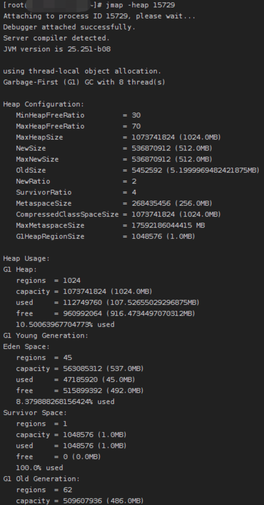
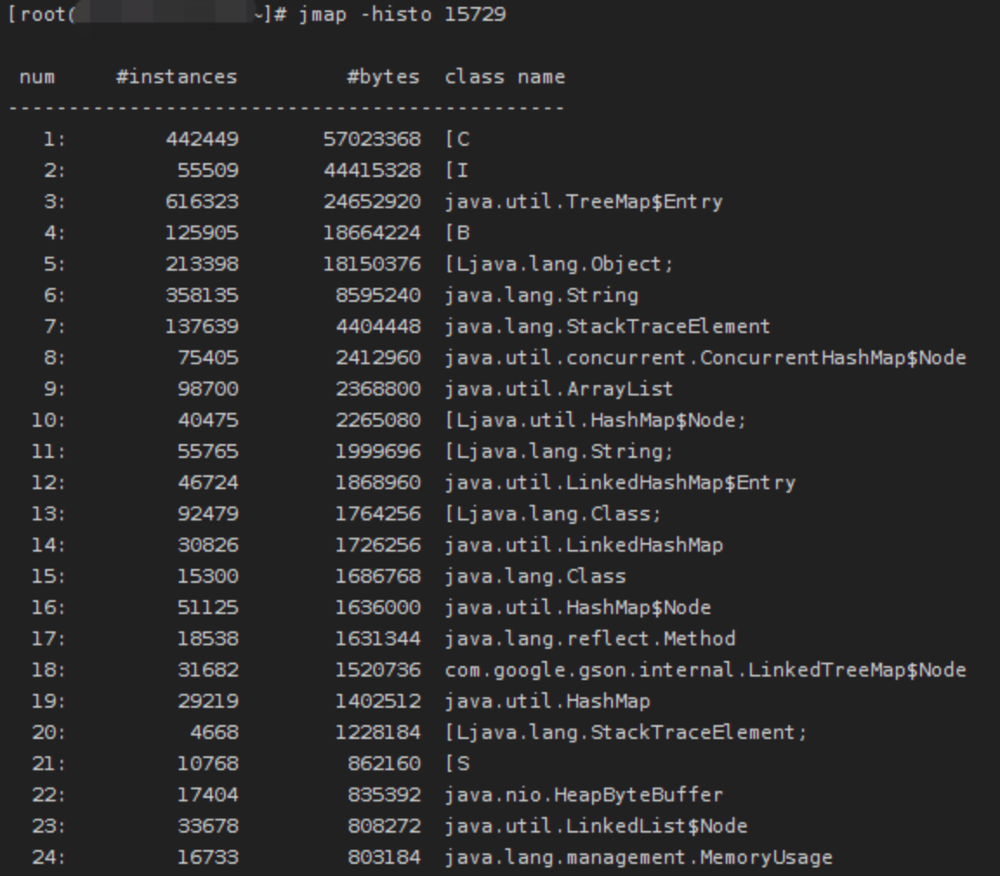
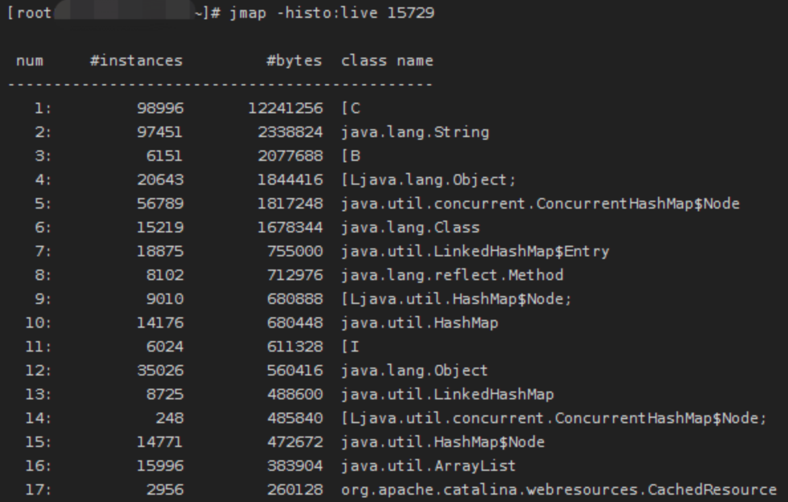
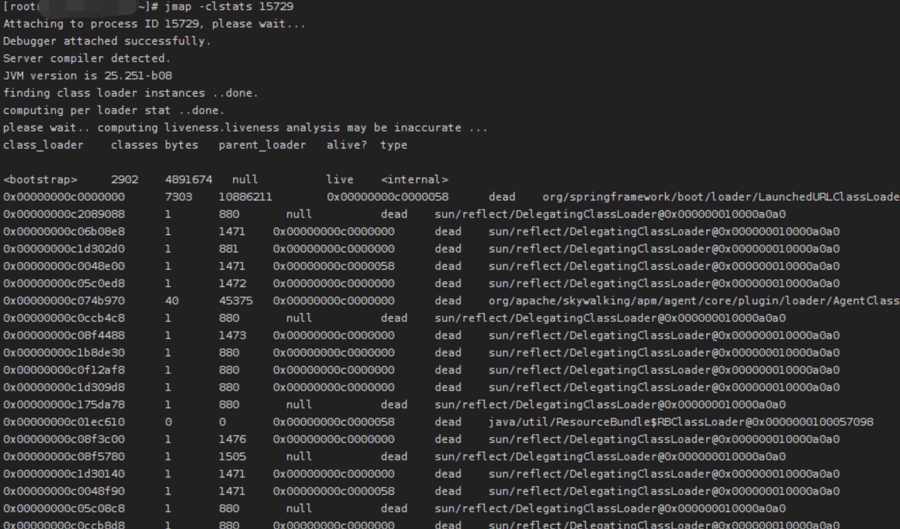
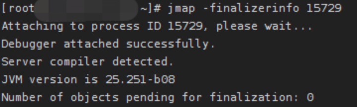
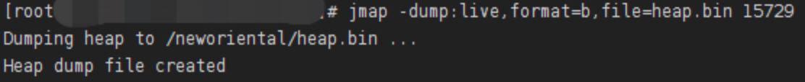
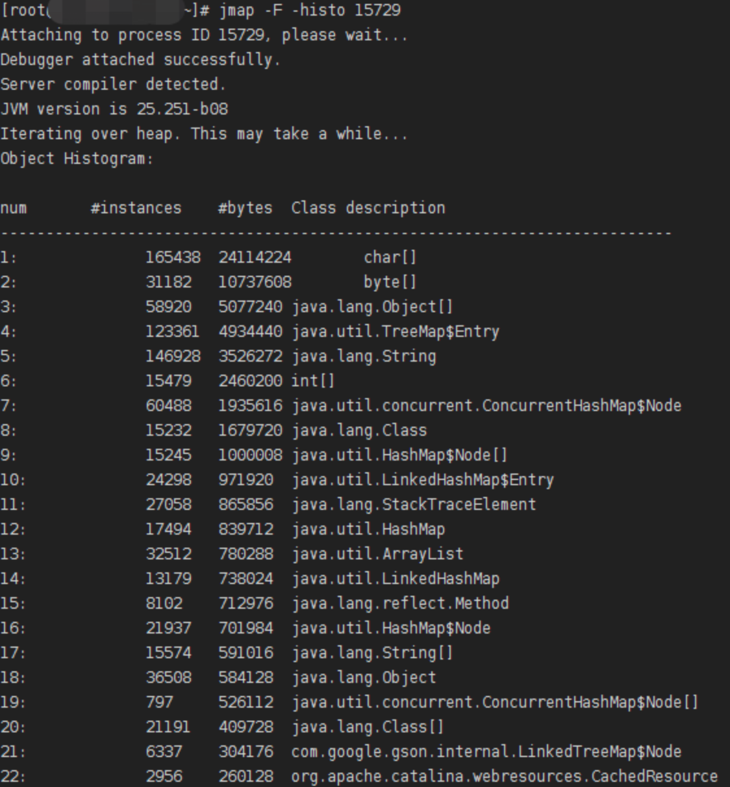

# JMAP
- [JMAP](#jmap)
  - [介绍](#介绍)
  - [命令参数](#命令参数)
    - [**-heap**](#-heap)
    - [**-histo\[:live\]**](#-histolive)
    - [**-clstats**](#-clstats)
    - [**-finalizerinfo**](#-finalizerinfo)
    - [**-dump\[:live\],format=b,file=\<filename\>**](#-dumpliveformatbfilefilename)
    - [**-F**](#-f)

## 介绍
jmap（Java Virtual Machine Memory Map）是JDK提供的一个可以生成Java虚拟机的堆转储快照dump文件的命令行工具。除此以外，jmap命令还可以查看finalize执行队列、Java堆和方法区的详细信息，比如空间使用率、当前使用的什么垃圾回收器、分代情况等等。

## 命令参数

命令语法: 
```shell
jmap [options] pid
```
下面是 options 的可选项: 

### **-heap**
显示Java堆的如下数据
- 被指定的垃圾回收算法的信息，包括垃圾回收算法的名称和垃圾回收算法的详细信息
- 堆的配置信息，可能是由命令行指定，或者由Java虚拟机根据服务器配置自动选择的
- 堆的内存空间使用信息


### **-histo[:live]**
显示Java堆中对象的统计信息，包括: 对象数量、占用内存大小(单位:字节)，和雷的完全限定名。

使用示例如下，可以根据对象内存总大小除以单个对象大小，算出对象数量: 


如果指定了live参数，则只计算活动对象。如下: 


### **-clstats**
显示Java堆中元空间的类加载器的统计信息，包括: 
- class_loader
  -  Java虚拟机运行的时候，类加载器对象的地址
- classes
  - 已加载类的数量
- bytes
  - 该类加载器的所有类的元数据所占的字节数
- parent_loader
  - 父类加载器对象的地址
  - 如果没有则显示 null
- alive
  - 是否存活的标识
  - 表示类加载器对象是否将被内存回收
- type
  - 该类加载器的类名

示例: 


### **-finalizerinfo**
显示在F-Queue中等待Finalizer线程执行finalize方法的对象。

示例:


### **-dump[:live],format=b,file=\<filename\>**
生成Java虚拟机的堆转储快照dump文件。

具体说明如下: 
- `live` 参数是可以指定的，如果指定则只转储堆中的活动对象；如果没有指定，则转储堆中的所有对象
- `format=b` 表示以hprof二进制格式转储Java堆的内存
- `file=<filename>` 用来指定快照文件的名字

示例: 


### **-F**
强制模式。如果指定的pid没有响应，可以配合`-dump`和`-histo`一起使用。

此模式下不支持`live`参数。

示例: 


