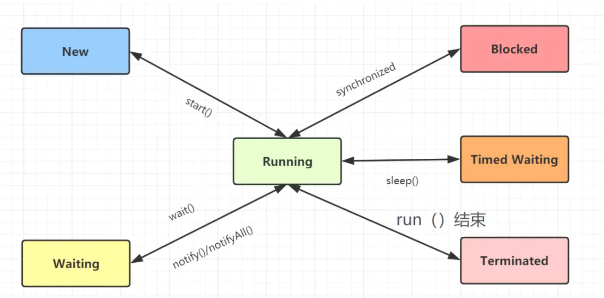
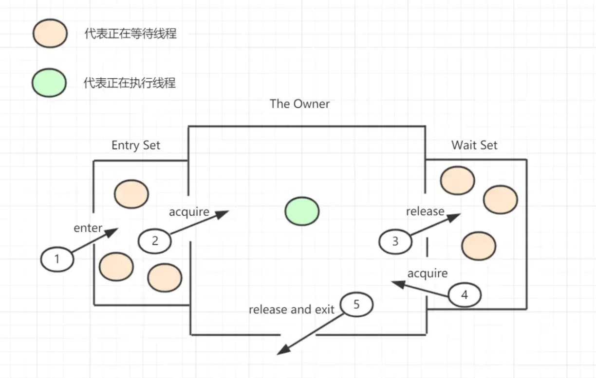
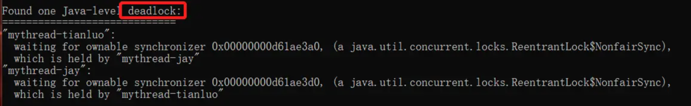
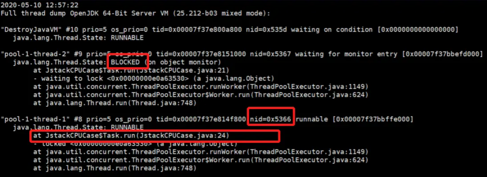

# JSTACK
- [JSTACK](#jstack)
  - [介绍](#介绍)
  - [线程状态](#线程状态)
  - [Monitor](#monitor)
  - [使用方式](#使用方式)
    - [jstack 命令格式如下](#jstack-命令格式如下)
    - [最常用的是](#最常用的是)
  - [Example 1 分析死锁](#example-1-分析死锁)
  - [Example 2 分析 CPU 过高](#example-2-分析-cpu-过高)

## 介绍
jstack是java虚拟机自带的一种堆栈跟踪工具。jstack用于打印出给定的java进程ID或core file或远程调试服务的Java堆栈信息，如果是在64位机器上，需要指定选项"-J-d64"。

主要分为两个功能： 
- a．针对活着的进程做本地的或远程的线程dump
- b．针对core文件做线程dump

jstack用于生成java虚拟机当前时刻的线程快照。

线程快照是当前java虚拟机内每一条线程正在执行的方法堆栈的集合，生成线程快照的主要目的是定位线程出现长时间停顿的原因，如线程间死锁、死循环、请求外部资源导致的长时间等待等。

线程出现停顿的时候通过jstack来查看各个线程的调用堆栈，就可以知道没有响应的线程到底在后台做什么事情，或者等待什么资源。 

如果java程序崩溃生成core文件，jstack工具可以用来获得core文件的java stack和native stack的信息，从而可以轻松地知道java程序是如何崩溃和在程序何处发生问题。

另外，jstack工具还可以附属到正在运行的java程序中，看到当时运行的java程序的java stack和native stack的信息, 如果现在运行的java程序呈现hung的状态，jstack是非常有用的。

> 所以jstack命令主要用来查看Java线程的调用堆栈的，可以用来分析线程问题（如死锁）。

## 线程状态
想要通过jstack命令来分析线程的情况的话，首先要知道线程都有哪些状态，下面这些状态是我们使用jstack命令查看线程堆栈信息时可能会看到的线程的几种状态：

- NEW
  - 未启动的。不会出现在Dump中。
- RUNNABLE
  - 在虚拟机内执行的。运行中状态，可能里面还能看到locked字样，表明它获得了某把锁。
  - 包括两种子状态 Running 和 Ready
- BLOCKED
  - 受阻塞并等待监视器锁。被某个锁(synchronizers)給block住了。
- WATING
  - 无限期等待另一个线程执行特定操作。等待某个condition或monitor发生，一般停留在park(), wait(), sleep(),join() 等语句里。
- TIMED_WATING
  - 有时限的等待另一个线程的特定操作。
  - 和WAITING的区别是wait() 等语句加上了时间限制 wait(timeout)。
- TERMINATED
  - 已终止线程的线程状态，线程已经结束执行。

Dump文件的线程状态一般其实就以下3种：
- RUNNABLE，线程处于执行中
- BLOCKED，线程被阻塞
- WAITING，线程正在等待



## Monitor
因为Java程序一般都是多线程运行的，Java多线程跟监视锁环环相扣，所以我们分析线程状态时，也需要回顾一下Monitor监视锁知识。

Monitor的工作原理图如下：


- 线程想要获取monitor,首先会进入Entry Set队列，它是Waiting Thread，线程状态是Waiting for monitor entry。
- 当某个线程成功获取对象的monitor后,进入Owner区域，它就是Active Thread。
- 如果线程调用了wait()方法，则会进入Wait Set队列，它会释放monitor锁，它也是Waiting Thread，线程状态in Object.wait()
- 如果其他线程调用 notify() / notifyAll() ，会唤醒Wait Set中的某个线程，该线程再次尝试获取monitor锁，成功即进入Owner区域。

## 使用方式

### jstack 命令格式如下
```shell
jstack [option] pid 
jstack [option] executable core 
jstack [option] [server-id@]remote-hostname-or-IP 
```

- executable Java executable from which the core dump was produced.(可能是产生core dump的java可执行程序)
- core 将被打印信息的core dump文件
- remote-hostname-or-IP 远程debug服务的主机名或ip
- server-id 唯一id,假如一台主机上多个远程debug服务

### 最常用的是
```shell
jstack [option] <pid>  // 打印某个进程的堆栈信息
```

Option参数: 
| 选项 | 作用                                                                            |
| ---- | ------------------------------------------------------------------------------- |
| -F   | 当正常输出的请求不被响应时，强制输出线程堆栈                                    |
| -m   | 如果调用到本地方法的话，可以显示C/C++的堆栈                                     |
| -l   | 除堆栈外，显示关于锁的附加信息，在发生死锁时可以用jstack -l pid来观察锁持有情况 |

## Example 1 分析死锁

```shell
jstack -l pid
```
输出: 


由上图，可以清晰看到死锁信息：
- mythread-tianluo 等待这个锁 `0x00000000d61ae3a0`，这个锁是由于`mythread-jay`线程持有。
- mythread-jay线程等待这个锁`0x00000000d61ae3d0`,这个锁是由`mythread-tianluo`线程持有。

## Example 2 分析 CPU 过高

jstack 分析CPU过高步骤
1. top
2. top -Hp pid
3. jstack pid
4. jstack -l [PID] >/tmp/log.txt
5. 分析堆栈信息



发现 0x5366 号线程一直在跑，分析对应函数发现死循环，CPU过高。
