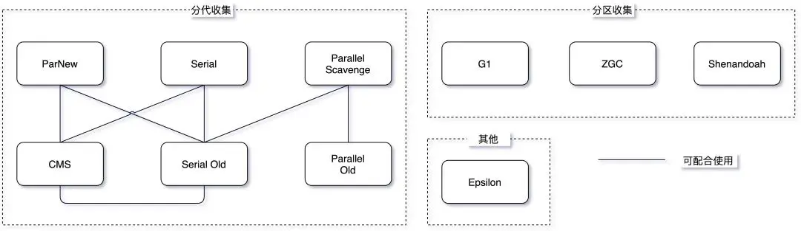
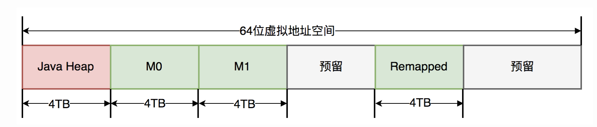
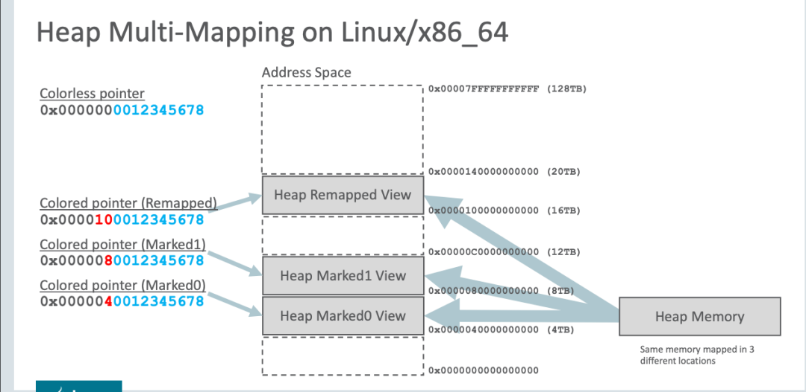

# GC
- [GC](#gc)
  - [介绍](#介绍)
  - [分代收集器](#分代收集器)
    - [CMS](#cms)
  - [分区收集器](#分区收集器)
    - [G1](#g1)
    - [ZGC](#zgc)
      - [读屏障](#读屏障)
      - [ZGC 的工作过程](#zgc-的工作过程)
        - [Stop-The-World 暂停阶段](#stop-the-world-暂停阶段)
        - [并发阶段](#并发阶段)

## 介绍
垃圾回收对于 Java 党来说，是一个绕不开的话题，工作中涉及到的调优工作也经常围绕着垃圾回收器展开。面对不同的业务场景，往往需要不同的垃圾收集器才能保证 GC 性能，因此，对于面大厂或者有远大志向的球友可以卷一下垃圾收集器。

就目前来说，JVM 的垃圾收集器主要分为两大类：分代收集器和分区收集器，分代收集器的代表是 CMS，分区收集器的代表是 G1 和 ZGC，下面我们来看看这两大类的垃圾收集器。

Reference: [深入理解 JVM 的垃圾收集器：CMS、G1、ZGC](https://javabetter.cn/jvm/gc-collector.html)

## 分代收集器

### CMS
以获取最短回收停顿时间为目标，采用“标记-清除”算法，分 4 大步进行垃圾收集，其中初始标记和重新标记会 STW，JDK 1.5 时引入，JDK9 被标记弃用，JDK14 被移除，详情可见  JEP 363。

CMS（Concurrent Mark Sweep）垃圾收集器是第一个关注 GC 停顿时间（STW 的时间）的垃圾收集器。之前的垃圾收集器，要么是串行的垃圾回收方式，要么只关注系统吞吐量。

CMS 垃圾收集器之所以能够实现对 GC 停顿时间的控制，其本质来源于对「可达性分析算法」的改进，即三色标记算法。在 CMS 出现之前，无论是 Serious 垃圾收集器，还是 ParNew 垃圾收集器，以及 Parallel Scavenge 垃圾收集器，它们在进行垃圾回收的时候都需要 Stop the World，无法实现垃圾回收线程与用户线程的并发执行。

CMS 垃圾收集器通过三色标记算法，实现了垃圾回收线程与用户线程的并发执行，从而极大地降低了系统响应时间，提高了强交互应用程序的体验。它的运行过程分为 4 个步骤，包括：

- 初始标记
- 并发标记
- 重新标记
- 并发清除

**初始标记**，指的是寻找所有被 GCRoots 引用的对象，该阶段需要「Stop the World」。这个步骤仅仅只是标记一下 GC Roots 能直接关联到的对象，并不需要做整个引用的扫描，因此速度很快。

**并发标记**，指的是对「初始标记阶段」标记的对象进行整个引用链的扫描，该阶段不需要「Stop the World」。 对整个引用链做扫描需要花费非常多的时间，因此通过垃圾回收线程与用户线程并发执行，可以降低垃圾回收的时间。

这也是 CMS 能极大降低 GC 停顿时间的核心原因，但这也带来了一些问题，即：并发标记的时候，引用可能发生变化，因此可能发生漏标（本应该回收的垃圾没有被回收）和多标（本不应该回收的垃圾被回收）了。

**重新标记**，指的是对「并发标记」阶段出现的问题进行校正，该阶段需要「Stop the World」。正如并发标记阶段说到的，由于垃圾回收算法和用户线程并发执行，虽然能降低响应时间，但是会发生漏标和多标的问题。所以对于 CMS 来说，它需要在这个阶段做一些校验，解决并发标记阶段发生的问题。

**并发清除**，指的是将标记为垃圾的对象进行清除，该阶段不需要「Stop the World」。 在这个阶段，垃圾回收线程与用户线程可以并发执行，因此并不影响用户的响应时间。

CMS 的优点是：并发收集、低停顿。但缺点也很明显：

①、对 CPU 资源非常敏感，因此在 CPU 资源紧张的情况下，CMS 的性能会大打折扣。

默认情况下，CMS 启用的垃圾回收线程数是（CPU数量 + 3)/4，当 CPU 数量很大时，启用的垃圾回收线程数占比就越小。但如果 CPU 数量很小，例如只有 2 个 CPU，垃圾回收线程占用就达到了 50%，这极大地降低系统的吞吐量，无法接受。

②、CMS 采用的是「标记-清除」算法，会产生大量的内存碎片，导致空间不连续，当出现大对象无法找到连续的内存空间时，就会触发一次 Full GC，这会导致系统的停顿时间变长。

③、CMS 无法处理浮动垃圾，当 CMS 在进行垃圾回收的时候，应用程序还在不断地产生垃圾，这些垃圾会在 CMS 垃圾回收结束之后产生，这些垃圾就是浮动垃圾，CMS 无法处理这些浮动垃圾，只能在下一次 GC 时清理掉。

## 分区收集器

### G1
G1（Garbage-First Garbage Collector）在 JDK 1.7 时引入，在 JDK 9 时取代 CMS 成为了默认的垃圾收集器。G1 有五个属性：分代、增量、并行、标记整理、STW。

①、分代：G1 将堆内存分为多个大小相等的区域（Region），每个区域都可以是 Eden 区、Survivor 区或者 Old 区。

可以通过 -XX:G1HeapRegionSize=n 来设置 Region 的大小，可以设定为 1M、2M、4M、8M、16M、32M（不能超过）。

G1 有专门分配大对象的 Region 叫 Humongous 区，而不是让大对象直接进入老年代的 Region 中。在 G1 中，大对象的判定规则就是一个大对象超过了一个 Region 大小的 50%，比如每个 Region 是 2M，只要一个对象超过了 1M，就会被放入 Humongous 中，而且一个大对象如果太大，可能会横跨多个 Region 来存放。

G1 会根据各个区域的垃圾回收情况来决定下一次垃圾回收的区域，这样就避免了对整个堆内存进行垃圾回收，从而降低了垃圾回收的时间。

②、增量：G1 可以以增量方式执行垃圾回收，这意味着它不需要一次性回收整个堆空间，而是可以逐步、增量地清理。有助于控制停顿时间，尤其是在处理大型堆时。

③、并行：G1 垃圾回收器可以并行回收垃圾，这意味着它可以利用多个 CPU 来加速垃圾回收的速度，这一特性在年轻代的垃圾回收（Minor GC）中特别明显，因为年轻代的回收通常涉及较多的对象和较高的回收速率。

④、标记整理：在进行老年代的垃圾回收时，G1 使用标记-整理算法。这个过程分为两个阶段：标记存活的对象和整理（压缩）堆空间。通过整理，G1 能够避免内存碎片化，提高内存利用率。

年轻代的垃圾回收（Minor GC）使用复制算法，因为年轻代的对象通常是朝生夕死的。

⑤、STW：G1 也是基于「标记-清除」算法，因此在进行垃圾回收的时候，仍然需要「Stop the World」。不过，G1 在停顿时间上添加了预测机制，用户可以指定期望停顿时间。

G1 中存在三种 GC 模式，分别是 Young GC、Mixed GC 和 Full GC。

当 Eden 区的内存空间无法支持新对象的内存分配时，G1 会触发 Young GC。

当需要分配对象到 Humongous 区域或者堆内存的空间占比超过 -XX:G1HeapWastePercent 设置的 InitiatingHeapOccupancyPercent 值时，G1 会触发一次 concurrent marking，它的作用就是计算老年代中有多少空间需要被回收，当发现垃圾的占比达到 -XX:G1HeapWastePercent 中所设置的 G1HeapWastePercent 比例时，在下次 Young GC 后会触发一次 Mixed GC。

Mixed GC 是指回收年轻代的 Region 以及一部分老年代中的 Region。Mixed GC 和 Young GC 一样，采用的也是复制算法。

在 Mixed GC 过程中，如果发现老年代空间还是不足，此时如果 G1HeapWastePercent 设定过低，可能引发 Full GC。-XX:G1HeapWastePercent 默认是 5，意味着只有 5% 的堆是“浪费”的。如果浪费的堆的百分比大于 G1HeapWastePercent，则运行 Full GC。

在以 Region 为最小管理单元以及所采用的 GC 模式的基础上，G1 建立了停顿预测模型，即 Pause Prediction Model 。这也是 G1 非常被人所称道的特性。

我们可以借助 -XX:MaxGCPauseMillis 来设置期望的停顿时间（默认 200ms），G1 会根据这个值来计算出一个合理的 Young GC 的回收时间，然后根据这个时间来制定 Young GC 的回收计划。

### ZGC

ZGC（The Z Garbage Collector）是 JDK11 推出的一款低延迟垃圾收集器，适用于大内存低延迟服务的内存管理和回收，SPEC jbb 2015 基准测试，在 128G 的大堆下，最大停顿时间才 1.68 ms，停顿时间远胜于 G1 和 CMS。

ZGC 的设计目标是：在不超过 10ms 的停顿时间下，支持 TB 级的内存容量和几乎所有的 GC 功能，这也是 ZGC 名字的由来，Z 代表着 Zettabyte，也就是 1024EB，也就是 1TB 的 1024 倍。

不过，我需要告诉大家的是，上面这段是我胡编的（😂），JDK 官方并没有明确给出 Z 的定义，就像小米汽车 su7，7 也是个魔数，没有明确的定义。

总之就是，ZGC 很牛逼，它的目标是：

停顿时间不超过 10ms；
停顿时间不会随着堆的大小，或者活跃对象的大小而增加；
支持 8MB~4TB 级别的堆，未来支持 16TB。
前面讲 G1 垃圾收集器的时候提到过，Young GC 和 Mixed GC 均采用的是复制算法，复制算法主要包括以下 3 个阶段：

①、标记阶段，从 GC Roots 开始，分析对象可达性，标记出活跃对象。

②、对象转移阶段，把活跃对象复制到新的内存地址上。

③、重定位阶段，因为转移导致对象地址发生了变化，在重定位阶段，所有指向对象旧地址的引用都要调整到对象新的地址上。

标记阶段因为只标记 GC Roots，耗时较短。但转移阶段和重定位阶段需要处理所有存活的对象，耗时较长，并且转移阶段是 STW 的，因此，G1 的性能瓶颈就主要卡在转移阶段。

与 G1 和 CMS 类似，ZGC 也采用了复制算法，只不过做了重大优化，ZGC 在标记、转移和重定位阶段几乎都是并发的，这是 ZGC 实现停顿时间小于 10ms 的关键所在。

ZGC 是怎么做到的呢？

- 指针染色（Colored Pointer）：一种用于标记对象状态的技术。
- 读屏障（Load Barrier）：一种在程序运行时插入到对象访问操作中的特殊检查，用于确保对象访问的正确性。
- 这两种技术可以让所有线程在并发的条件下就指针的颜色 (状态) 达成一致，而不是对象地址。因此，ZGC 可以并发的复制对象，这大大的降低了 GC 的停顿时间。

指针染色
在一个指针中，除了存储对象的实际地址外，还有额外的位被用来存储关于该对象的元数据信息。这些信息可能包括：

- 对象是否被移动了（即它是否在回收过程中被移动到了新的位置）。
- 对象的存活状态。
- 对象是否被锁定或有其他特殊状态。
- 通过在指针中嵌入这些信息，ZGC 在标记和转移阶段会更快，因为通过指针上的颜色就能区分出对象状态，不用额外做内存访问。

ZGC仅支持64位系统，它把64位虚拟地址空间划分为多个子空间，如下图所示：

其中，0-4TB 对应 Java 堆，4TB-8TB 被称为 M0 地址空间，8TB-12TB 被称为 M1 地址空间，12TB-16TB 预留未使用，16TB-20TB 被称为 Remapped 空间。

当创建对象时，首先在堆空间申请一个虚拟地址，该虚拟地址并不会映射到真正的物理地址。同时，ZGC 会在 M0、M1、Remapped 空间中为该对象分别申请一个虚拟地址，且三个虚拟地址都映射到同一个物理地址。

下图是虚拟地址的空间划分：

不过，三个空间在同一时间只有一个空间有效。ZGC 之所以设置这三个虚拟地址，是因为 ZGC 采用的是“空间换时间”的思想，去降低 GC 的停顿时间。

与上述地址空间划分相对应，ZGC实际仅使用64位地址空间的第0-41位，而第42-45位存储元数据，第47-63位固定为0。

由于仅用了第 0~43 位存储对象地址，所以 ZGC 最大支持 16TB 的堆。

至于对象的存活信息，则存储在42-45位中，这与传统的垃圾回收并将对象存活信息放在对象头中完全不同。

#### 读屏障
当程序尝试读取一个对象时，读屏障会触发以下操作：

- 检查指针染色：读屏障首先检查指向对象的指针的颜色信息。
- 处理移动的对象：如果指针表示对象已经被移动（例如，在垃圾回收过程中），读屏障将确保返回对象的新位置。
- 确保一致性：通过这种方式，ZGC 能够在并发移动对象时保持内存访问的一致性，从而减少对应用程序停顿的需要。

#### ZGC 的工作过程
ZGC 周期由三个 STW 暂停和四个并发阶段组成：标记/重新映射( M/R )、并发引用处理( RP )、并发转移准备( EC ) 和并发转移( RE )。

##### Stop-The-World 暂停阶段
- 标记开始（Mark Start）STW 暂停：这是 ZGC 的开始，进行 GC Roots 的初始标记。在这个短暂的停顿期间，ZGC 标记所有从 GC Root 直接可达的对象。
- 重新映射开始（Relocation Start）STW 暂停：在并发阶段之后，这个 STW 暂停是为了准备对象的重定位。在这个阶段，ZGC 选择将要清理的内存区域，并建立必要的数据结构以进行对象移动。
- 暂停结束（Pause End）STW 暂停：ZGC 结束。在这个短暂的停顿中，完成所有与该 GC 周期相关的最终清理工作。

##### 并发阶段
- 并发标记/重新映射 (M/R) ：这个阶段包括并发标记和并发重新映射。在并发标记中，ZGC 遍历对象图，标记所有可达的对象。然后，在并发重新映射中，ZGC 更新指向移动对象的所有引用。
- 并发引用处理 (RP) ：在这个阶段，ZGC 处理各种引用类型（如软引用、弱引用、虚引用和幽灵引用）。这些引用的处理通常需要特殊的考虑，因为它们与对象的可达性和生命周期密切相关。
- 并发转移准备 (EC) ：这是为对象转移做准备的阶段。ZGC 确定哪些内存区域将被清理，并准备相关的数据结构。
- 并发转移 (RE) ：在这个阶段，ZGC 将存活的对象从旧位置移动到新位置。由于这一过程是并发执行的，因此应用程序可以在大多数垃圾回收工作进行时继续运行。

> ZGC 的两个关键技术：指针染色和读屏障，不仅应用在并发转移阶段，还应用在并发标记阶段：将对象设置为已标记，传统的垃圾回收器需要进行一次内存访问，并将对象存活信息放在对象头中；而在ZGC中，只需要设置指针地址的第42-45位即可，并且因为是寄存器访问，所以速度比访问内存更快。

