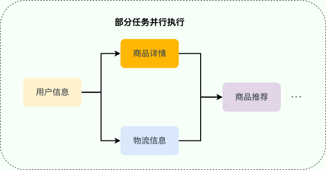

# Java CompletableFuture
- [Java CompletableFuture](#java-completablefuture)
  - [介绍](#介绍)
  - [CompletableFuture 常见操作](#completablefuture-常见操作)
    - [创建 CompletableFuture](#创建-completablefuture)
      - [通过 new 关键字](#通过-new-关键字)
      - [通过静态工厂方法](#通过静态工厂方法)
    - [处理异步结算的结果](#处理异步结算的结果)
    - [异常处理](#异常处理)
    - [组合多个 CompletableFuture](#组合多个-completablefuture)
    - [并行运行多个 CompletableFuture](#并行运行多个-completablefuture)
  - [CompletableFuture 使用建议](#completablefuture-使用建议)
    - [使用自定义线程池](#使用自定义线程池)
    - [尽量避免使用 get()](#尽量避免使用-get)
    - [正确进行异常处理](#正确进行异常处理)
    - [合理组合多个异步任务](#合理组合多个异步任务)

## 介绍
实际项目中，一个接口可能需要同时获取多种不同的数据，然后再汇总返回，这种场景还是挺常见的。举个例子：用户请求获取订单信息，可能需要同时获取用户信息、商品详情、物流信息、商品推荐等数据。

如果是串行（按顺序依次执行每个任务）执行的话，接口的响应速度会非常慢。考虑到这些任务之间有大部分都是 无前后顺序关联 的，可以 并行执行 ，就比如说调用获取商品详情的时候，可以同时调用获取物流信息。通过并行执行多个任务的方式，接口的响应速度会得到大幅优化。

对于存在前后调用顺序关系的任务，可以进行任务编排。



对于 Java 程序来说，Java 8 才被引入的 CompletableFuture 可以帮助我们来做多个任务的编排，功能非常强大。

## CompletableFuture 常见操作

### 创建 CompletableFuture
常见的创建 CompletableFuture 对象的方法如下：
1. 通过 new 关键字。
2. 基于 CompletableFuture 自带的静态工厂方法：runAsync()、supplyAsync() 。

#### 通过 new 关键字
通过 new 关键字创建 CompletableFuture 对象这种使用方式可以看作是将 CompletableFuture 当做 Future 来使用。

下面咱们来看一个简单的案例。

我们通过创建了一个结果值类型为 RpcResponse<Object> 的 CompletableFuture，你可以把 resultFuture 看作是异步运算结果的载体。

```java
CompletableFuture<RpcResponse<Object>> resultFuture = new CompletableFuture<>();
```
假设在未来的某个时刻，我们得到了最终的结果。这时，我们可以调用 complete() 方法为其传入结果，这表示 resultFuture 已经被完成了。

```java
resultFuture.complete(new RpcResponse<Object>(result));
```
你可以通过 isDone() 方法来检查是否已经完成。

```java
resultFuture.isDone();
```
你可以通过 get() 方法来获取结果。
```java
resultFuture.get();
```
你也可以通过 get(long timeout, TimeUnit unit) 方法来获取结果，该方法可以设置超时时间。

如果你已经知道计算的结果的话，可以使用静态方法 completedFuture() 来创建 CompletableFuture 。
```java
CompletableFuture<String> future = CompletableFuture.completedFuture("hello!");
assertEquals("hello!", future.get());
```

completedFuture() 方法底层调用的是带参数的 new 方法，只不过，这个方法不对外暴露。

```java
public static <U> CompletableFuture<U> completedFuture(U value) {
    return new CompletableFuture<U>((value == null) ? NIL : value);
}
```

#### 通过静态工厂方法

这两个方法可以帮助我们封装计算逻辑。

```java
static <U> CompletableFuture<U> supplyAsync(Supplier<U> supplier);
// 使用自定义线程池(推荐)
static <U> CompletableFuture<U> supplyAsync(Supplier<U> supplier, Executor executor);
static CompletableFuture<Void> runAsync(Runnable runnable);
// 使用自定义线程池(推荐)
static CompletableFuture<Void> runAsync(Runnable runnable, Executor executor);
```

下面咱们来看一个简单的案例。

```java
CompletableFuture<Void> future = CompletableFuture.runAsync(() -> System.out.println("hello!"));
future.get();// 输出 "hello!"
CompletableFuture<String> future2 = CompletableFuture.supplyAsync(() -> "hello!");
assertEquals("hello!", future2.get());
```

### 处理异步结算的结果

当我们获取到异步计算的结果之后，还可以对其进行进一步的处理，比较常用的方法有下面几个：

- thenApply()
- thenAccept()
- thenRun()
- whenComplete()

thenApply() 方法接受一个 Function 实例，用它来处理结果。

```java
// 沿用上一个任务的线程池
public <U> CompletableFuture<U> thenApply(
    Function<? super T,? extends U> fn) {
    return uniApplyStage(null, fn);
}

//使用默认的 ForkJoinPool 线程池（不推荐）
public <U> CompletableFuture<U> thenApplyAsync(
    Function<? super T,? extends U> fn) {
    return uniApplyStage(defaultExecutor(), fn);
}
// 使用自定义线程池(推荐)
public <U> CompletableFuture<U> thenApplyAsync(
    Function<? super T,? extends U> fn, Executor executor) {
    return uniApplyStage(screenExecutor(executor), fn);
}
```

thenApply() 方法使用示例如下：

```java
CompletableFuture<String> future = CompletableFuture.completedFuture("hello!")
        .thenApply(s -> s + "world!");
assertEquals("hello!world!", future.get());
// 这次调用将被忽略。
future.thenApply(s -> s + "nice!");
assertEquals("hello!world!", future.get());
```

可以链式调用 thenApply() 方法。
```java
CompletableFuture<String> future = CompletableFuture.completedFuture("hello!")
        .thenApply(s -> s + "world!").thenApply(s -> s + "nice!");
assertEquals("hello!world!nice!", future.get());
```

如果你不需要从回调函数中获取返回结果，可以使用 thenAccept() 或者 thenRun()。这两个方法的区别在于 thenRun() 不能访问异步计算的结果。

thenAccept() 方法的参数是 Consumer<? super T> 。thenRun() 的方法是的参数是 Runnable 。

```java
public CompletableFuture<Void> thenAccept(Consumer<? super T> action) {
    return uniAcceptStage(null, action);
}

public CompletableFuture<Void> thenAcceptAsync(Consumer<? super T> action) {
    return uniAcceptStage(defaultExecutor(), action);
}

public CompletableFuture<Void> thenAcceptAsync(Consumer<? super T> action,
                                               Executor executor) {
    return uniAcceptStage(screenExecutor(executor), action);
}

public CompletableFuture<Void> thenRun(Runnable action) {
    return uniRunStage(null, action);
}

public CompletableFuture<Void> thenRunAsync(Runnable action) {
    return uniRunStage(defaultExecutor(), action);
}

public CompletableFuture<Void> thenRunAsync(Runnable action,
                                            Executor executor) {
    return uniRunStage(screenExecutor(executor), action);
}
```

使用示例如下：
```java
CompletableFuture.completedFuture("hello!")
        .thenApply(s -> s + "world!").thenApply(s -> s + "nice!").thenAccept(System.out::println);//hello!world!nice!

CompletableFuture.completedFuture("hello!")
        .thenApply(s -> s + "world!").thenApply(s -> s + "nice!").thenRun(() -> System.out.println("hello!"));//hello!
```

### 异常处理

你可以通过 handle() 方法来处理任务执行过程中可能出现的抛出异常的情况。

```java
public <U> CompletableFuture<U> handle(
    BiFunction<? super T, Throwable, ? extends U> fn) {
    return uniHandleStage(null, fn);
}

public <U> CompletableFuture<U> handleAsync(
    BiFunction<? super T, Throwable, ? extends U> fn) {
    return uniHandleStage(defaultExecutor(), fn);
}

public <U> CompletableFuture<U> handleAsync(
    BiFunction<? super T, Throwable, ? extends U> fn, Executor executor) {
    return uniHandleStage(screenExecutor(executor), fn);
}
```

使用示例如下：
```java
CompletableFuture<String> future
        = CompletableFuture.supplyAsync(() -> {
    if (true) {
        throw new RuntimeException("Computation error!");
    }
    return "hello!";
}).handle((res, ex) -> {
    // res 代表返回的结果
    // ex 的类型为 Throwable ，代表抛出的异常
    return res != null ? res : "world!";
});
assertEquals("world!", future.get());
```

你还可以通过 exceptionally() 方法来处理异常情况。

```java
CompletableFuture<String> future
        = CompletableFuture.supplyAsync(() -> {
    if (true) {
        throw new RuntimeException("Computation error!");
    }
    return "hello!";
}).exceptionally(ex -> {
    System.out.println(ex.toString());// CompletionException
    return "world!";
});
assertEquals("world!", future.get());
```

如果你想让 CompletableFuture 的结果就是异常的话，可以使用 completeExceptionally() 方法为其赋值。

```java
CompletableFuture<String> completableFuture = new CompletableFuture<>();
// ...
completableFuture.completeExceptionally(
  new RuntimeException("Calculation failed!"));
// ...
completableFuture.get(); // ExecutionException
```

### 组合多个 CompletableFuture

你可以使用 thenCompose() 按顺序链接两个 CompletableFuture 对象，实现异步的任务链。它的作用是将前一个任务的返回结果作为下一个任务的输入参数，从而形成一个依赖关系。

```java
public <U> CompletableFuture<U> thenCompose(
    Function<? super T, ? extends CompletionStage<U>> fn) {
    return uniComposeStage(null, fn);
}

public <U> CompletableFuture<U> thenComposeAsync(
    Function<? super T, ? extends CompletionStage<U>> fn) {
    return uniComposeStage(defaultExecutor(), fn);
}

public <U> CompletableFuture<U> thenComposeAsync(
    Function<? super T, ? extends CompletionStage<U>> fn,
    Executor executor) {
    return uniComposeStage(screenExecutor(executor), fn);
}
```

使用示例如下：

```java
CompletableFuture<String> future
        = CompletableFuture.supplyAsync(() -> "hello!")
        .thenCompose(s -> CompletableFuture.supplyAsync(() -> s + "world!"));
assertEquals("hello!world!", future.get());
```

在实际开发中，这个方法还是非常有用的。比如说，task1 和 task2 都是异步执行的，但 task1 必须执行完成后才能开始执行 task2（task2 依赖 task1 的执行结果）。和 thenCompose() 方法类似的还有 thenCombine() 方法， 它同样可以组合两个 CompletableFuture 对象。

那 thenCompose() 和 thenCombine() 有什么区别呢？

thenCompose() 可以链接两个 CompletableFuture 对象，并将前一个任务的返回结果作为下一个任务的参数，它们之间存在着先后顺序。


thenCombine() 会在两个任务都执行完成后，把两个任务的结果合并。两个任务是并行执行的，它们之间并没有先后依赖顺序。

除了 thenCompose() 和 thenCombine() 之外， 还有一些其他的组合 CompletableFuture 的方法用于实现不同的效果，满足不同的业务需求。

### 并行运行多个 CompletableFuture

你可以通过 CompletableFuture 的 allOf()这个静态方法来并行运行多个 CompletableFuture 。

实际项目中，我们经常需要并行运行多个互不相关的任务，这些任务之间没有依赖关系，可以互相独立地运行。

示例代码如下：

```java
CompletableFuture<Void> task1 =
  CompletableFuture.supplyAsync(()->{
    //自定义业务操作
  });
......
CompletableFuture<Void> task6 =
  CompletableFuture.supplyAsync(()->{
    //自定义业务操作
  });
......
 CompletableFuture<Void> headerFuture=CompletableFuture.allOf(task1,.....,task6);

  try {
    headerFuture.join();
  } catch (Exception ex) {
    ......
  }
System.out.println("all done. ");
```

经常和 allOf() 方法拿来对比的是 anyOf() 方法。

allOf() 方法会等到所有的 CompletableFuture 都运行完成之后再返回

调用 join() 可以让程序等future1 和 future2 都运行完了之后再继续执行。

```java
CompletableFuture<Void> completableFuture = CompletableFuture.allOf(future1, future2);
completableFuture.join();
assertTrue(completableFuture.isDone());
System.out.println("all futures done...");
```

anyOf() 方法不会等待所有的 CompletableFuture 都运行完成之后再返回，只要有一个执行完成即可。

```java
CompletableFuture<Object> f = CompletableFuture.anyOf(future1, future2);
System.out.println(f.get());
```
输出结果可能是 Future2 的，也可能是 Future1 的。

## CompletableFuture 使用建议

### 使用自定义线程池
我们上面的代码示例中，为了方便，都没有选择自定义线程池。实际项目中，这是不可取的。

CompletableFuture 默认使用全局共享的 ForkJoinPool.commonPool() 作为执行器，所有未指定执行器的异步任务都会使用该线程池。这意味着应用程序、多个库或框架（如 Spring、第三方库）若都依赖 CompletableFuture，默认情况下它们都会共享同一个线程池。

虽然 ForkJoinPool 效率很高，但当同时提交大量任务时，可能会导致资源竞争和线程饥饿，进而影响系统性能。

为避免这些问题，建议为 CompletableFuture 提供自定义线程池，带来以下优势：
- 隔离性：为不同任务分配独立的线程池，避免全局线程池资源争夺。
- 资源控制：根据任务特性调整线程池大小和队列类型，优化性能表现。
- 异常处理：通过自定义 ThreadFactory 更好地处理线程中的异常情况。

### 尽量避免使用 get()
CompletableFuture的get()方法是阻塞的，尽量避免使用。如果必须要使用的话，需要添加超时时间，否则可能会导致主线程一直等待，无法执行其他任务。

### 正确进行异常处理
使用 CompletableFuture的时候一定要以正确的方式进行异常处理，避免异常丢失或者出现不可控问题。

下面是一些建议：

- 使用 whenComplete 方法可以在任务完成时触发回调函数，并正确地处理异常，而不是让异常被吞噬或丢失。
- 使用 exceptionally 方法可以处理异常并重新抛出，以便异常能够传播到后续阶段，而不是让异常被忽略或终止。
- 使用 handle 方法可以处理正常的返回结果和异常，并返回一个新的结果，而不是让异常影响正常的业务逻辑。
- 使用 CompletableFuture.allOf 方法可以组合多个 CompletableFuture，并统一处理所有任务的异常，而不是让异常处理过于冗长或重复。

### 合理组合多个异步任务
正确使用 thenCompose() 、 thenCombine() 、acceptEither()、allOf()、anyOf()等方法来组合多个异步任务，以满足实际业务的需求，提高程序执行效率。

实际使用中，我们还可以利用或者参考现成的异步任务编排框架，比如京东的 asyncTool 。

