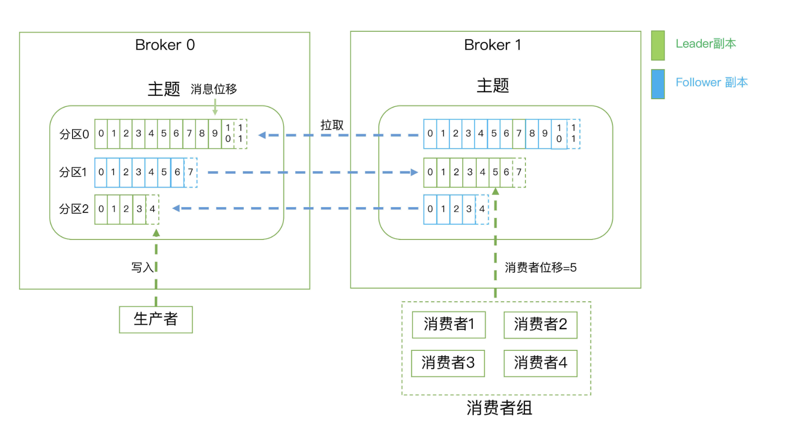

# Kafka
- [Kafka](#kafka)
  - [Kafka架构](#kafka架构)
    - [Producer](#producer)
    - [Consumer](#consumer)
    - [Topic](#topic)
    - [ConsumerGroup](#consumergroup)
    - [Broker](#broker)
    - [Partition](#partition)
    - [Offset](#offset)
    - [Replica](#replica)
    - [Leader](#leader)
    - [Follower](#follower)

## Kafka架构
Kafka 架构分为以下几个部分: 
- Producer
- Consumer
- Topic
- ConsumerGroup
- Broker
- Partition
- Offset

### Producer
- 消息生产者
- 就是向 kafka broker 发消息的客户端。

### Consumer
- 消息消费者
- 向 kafka broker 取消息的客户端。

### Topic
- 可以理解为一个队列
- 一个 Topic 又分为一个或多个分区

### ConsumerGroup
- 这是 kafka 用来实现一个 topic 消息的广播（发给所有的 consumer）和单播（发给任意一个 consumer）的手段
- 一个 topic 可以有多个 Consumer Group。
> - 在同一个消费者组内，一个 Partition 只能被一个消费者消费。
> - 在同一个消费者组内，所有消费者组合起来必定可以消费一个 Topic 下的所有 Partition。
> - 在同一个消费组内，一个消费者可以消费多个 Partition 的信息。
> - 在不同消费者组内，同一个分区可以被多个消费者消费。
> - 每个消费者组一定会完整消费一个 Topic 下的所有 Partition。
> - 同一个group中的消费者对于一个topic中的多个partition，存在一定的分区分配策略。在kafka中，存在三种分区分配策略: Range(默认)、 RoundRobin(轮询)、StickyAssignor(粘性)。

### Broker
- 一台 kafka 服务器就是一个 broker
- 一个集群由多个 broker 组成。一个 broker 可以容纳多个 topic

### Partition
- Partition 就是分区
- 为了实现扩展性，一个非常大的 topic 可以分布到多个 broker上，每个 partition 是一个有序的队列
- partition 中的每条消息都会被分配一个有序的id（offset）。
- 将消息发给 consumer，kafka 只保证按一个 partition 中的消息的顺序，不保证一个 topic 的整体（多个 partition 间）的顺序。

### Offset
- kafka 的存储文件都是按照 offset.kafka 来命名
- 用 offset 做名字的好处是方便查找
- 例如你想找位于 2049 的位置，只要找到 2048.kafka 的文件即可
- 当然 the first offset 就是 00000000000.kafka。

### Replica
- 副本
- 同一分区的不同副本保存的是相同的消息
- 为保证集群中的某个节点发生故障时，该节点上的partition数据不丢失，且kafka能正常工作，kafka提供了副本机制
- 一个topic的每个分区都有若干个副本，一个Leader和若干Follower

### Leader
- 每个分区的多个副本中的"主副本"
- 生产者与消费者只和Leader交互

### Follower
- 每个分区的多个副本中的"从副本"
- 负责实时从Leader中同步数据，保持和Leader数据的同步
- Leader故障时，从Follower中重新选举新的Leader

