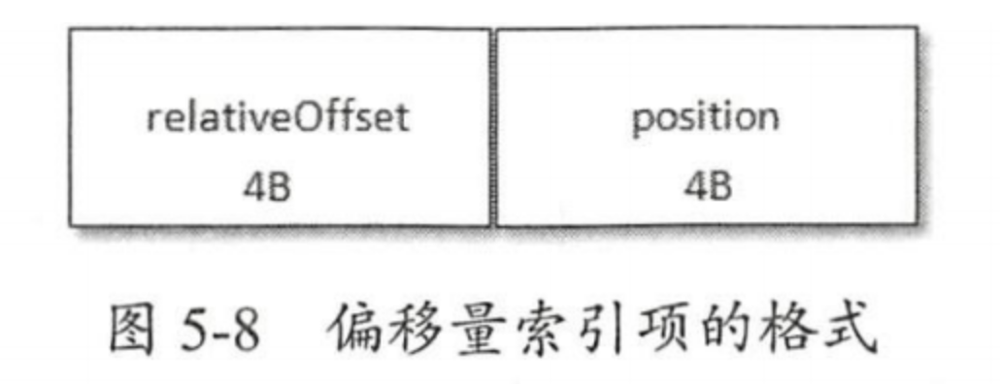
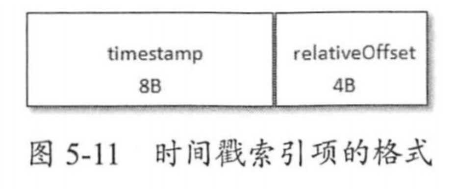

# Log
- [Log](#log)
  - [Kafka Log日志](#kafka-log日志)
  - [Kafka 日志索引](#kafka-日志索引)
    - [偏移量索引](#偏移量索引)
    - [时间戳索引](#时间戳索引)
  - [日志清理](#日志清理)
    - [日志删除](#日志删除)
      - [基于时间](#基于时间)
      - [基于日志大小](#基于日志大小)
      - [基于日志起始偏移量](#基于日志起始偏移量)
    - [日志压缩](#日志压缩)
  - [磁盘存储](#磁盘存储)
    - [顺序写盘](#顺序写盘)
    - [页缓存](#页缓存)
    - [零拷贝](#零拷贝)

## Kafka Log日志

## Kafka 日志索引

日志分段文件包括了2个索引文件：偏移量索引文件和时间戳索引文件。其中，偏移量索引文件用来建立消息偏移量与物理地址之间的映射关系，时间戳索引文件则是用来建立时间戳与偏移量的映射关系。索引文件是以稀疏索引的方式构建的。

偏移量索引文件中的偏移量是单调递增的，查询时通过二分法快速定位到小于指定偏移量的最大偏移量，然后根据对应的物理地址继续查找对应偏移量的消息。时间戳索引中的时间戳也是单调递增的，查询时也是先定位到小于指定时间的最大偏移量，然后再使用偏移量索引继续进行查询。

### 偏移量索引

偏移量索引项格式如上所示。每个索引项占用8个字节，分为两部分：
- relativeOffset
  - 相对偏移量
  - 4字节
  - 表示消息相对于baseOffset的偏移量
  - 当前文件的文件名即为baseOffset的值
- position
  - 物理地址
  - 4字节
  - 表示消息在分段日志文件的物理位置

根据偏移量索引查找消息过程如下：
1. 使用二分法快速定位偏移量索引文件。因为文件名就是baseOffset，所以可以快速定位到该文件。
2. 使用二分法快速定位索引项。具体来说就是在索引文件中找到小于当前偏移量的最大偏移量的索引项。
3. 从上一步中索引项的物理地址开始，顺序查找出对应偏移量的消息。

命名：
- 偏移量索引文件的命名格式为 <baseOffset>.index
- 其中 <baseOffset> 是日志段的起始偏移量
- 例如，00000000000000000000.index 表示起始偏移量为 0 的日志段的偏移量索引文件

功能：
- 快速定位
  - 偏移量索引允许 Kafka 通过二分查找快速找到特定消息的物理位置
  - 这种快速查找机制显著减少了读取延迟，特别是在处理大量消息时
- 稀疏索引
  - Kafka 使用稀疏索引方式，即并不是每条消息都有一个索引条目，而是每隔一定字节数（由 log.index.interval.bytes 参数配置）创建一个索引条目
  - 稀疏索引减少了索引文件的大小和内存占用，同时仍然能提供快速查找能力

### 时间戳索引

时间戳索引项格式如上所示。每个索引项占用12个字节，分为两部分：
- timestamp
  - 8字节
  - 当前日志分段的最大时间戳
- relativeOffset
  - 4字节
  - 时间戳对应消息的相对偏移量
> **注意：时间戳索引文件的大小必须是12B大小的倍数**

根据时间戳查找对应消息的过程如下：
1. 根据时间戳到每个日志分段文件中最大的时间戳逐一比较，定位到时间戳索引文件。因为时间戳索引文件也是使用了baseOffset命名，所以没办法直接通过二分法快速定位到。
2. 使用二分法快速定位时间戳索引项。
3. 根据上一步中的偏移量，通过偏移量索引查出对应的消息。

命名：
- 时间索引文件的命名格式为 <baseOffset>.timeindex
- 其中 <baseOffset> 是日志段的起始偏移量
- 例如，00000000000000000000.timeindex 表示起始偏移量为 0 的日志段的时间索引文件

功能：
- 基于时间的查找
  - 时间索引允许 Kafka 快速查找特定时间范围内的消息，这对于需要按时间范围消费消息的应用非常有用
  - 通过时间索引，可以高效地实现时间戳到消息位置的映射

## 日志清理
Kafka将消息存在磁盘中，为了控制占用磁盘空间不断增加，Kafka支持了日志清理功能。kafka提供了两种日志清理策略：

- 日志删除（Log Retention）：按照一定的保留策略直接删除不符合条件的日志分段。
- 日志压缩（Log Compaction）：针对每个消息的key进行整合，对于相同key的不同value值，只保留最后一个版本。

### 日志删除
Kafka会周期性的检测并删除不符合保留条件的日志分段文件。这个周期可以通过broker端参数log.tetention.check.interval.ms配置，默认5分钟。当前日志分段的保留策略有三种：基于时间的保留策略、基于日志大小的保留策略和基于日志起始偏移量的保留策略。

#### 基于时间
日志删除任务会检查当前日志文件保留时间超过设置阈值的日志分段集合，然后对应的所有文件加上.deleted后缀，最后由一个延迟任务来删除这些文件。阈值可以通过broker端参数log.retention.ms、log.retention.minutes和log.retention.hours设置，默认是7天。

#### 基于日志大小
日志删除任务会检查当前日志大小超过设置阈值的日志分段集合，然后对应的所有文件加上.deleted后缀，最后由一个延迟任务来删除这些文件。阈值可以通过broker端参数log.retention.bytes设置，默认值为-1，表示无穷大。

#### 基于日志起始偏移量
日志删除任务会检查当前日志分段的下一个日志分段的baseOffset小于等于logStartOffset的日志分段集合，然后对应的所有文件加上.deleted后缀，最后由一个延迟任务来删除这些文件。

### 日志压缩
日志压缩是在默认日志删除规则之外提供的一种清理数据的方式。日志压缩对于相同key的不同value值，只保留最后一个版本。

## 磁盘存储
kafka使用磁盘来存储消息。大家都知道，磁盘的读写性能是相对比较差的，那么使用磁盘的kafka做到高性能的呢？

### 顺序写盘
实际上，顺序写盘的性能并不差，是随机写盘的6000倍以上。kafka在设计时采用了文件追加的方式来写入消息，就是使用了顺序写盘来保证高性能。

### 页缓存
页缓存是操作系统支持的磁盘缓存，以此来减少磁盘I/O操作。简单来说，就是操作系统基于页为单位把磁盘中的热点数据缓存在内存中，进而将大量的I/O操作转换为内存操作，大大提高了整体性能。kafka中大量使用了页缓存，消息都是先写入页缓存中，然后才由操作系统写入到磁盘中。

### 零拷贝
零拷贝是指将数据直接从磁盘文件复制到网卡设备中，不需要经过应用程序。零拷贝大大提高了应用程序的性能，减少了内核和用户模式的上下文切换。kafka采用了零拷贝技术来进一步提升性能。
