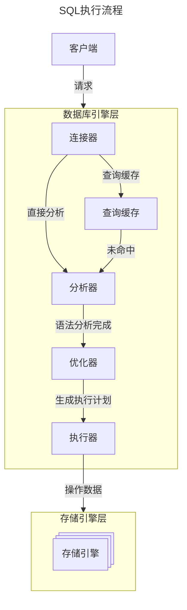

# MySQL架构
- [MySQL架构](#mysql架构)
  - [SQL执行流程](#sql执行流程)
    - [查询语句执行流程概述](#查询语句执行流程概述)
    - [更新语句执行流程概述](#更新语句执行流程概述)
  - [连接器](#连接器)
  - [查询缓存](#查询缓存)
  - [分析器](#分析器)
  - [优化器](#优化器)
  - [执行器](#执行器)
  - [存储引擎](#存储引擎)
  - [总结](#总结)

## SQL执行流程
### 查询语句执行流程概述
以如下SQL为例: 
```SQL
select * from t_user where id = 100
```

### 更新语句执行流程概述
以如下SQL为例: 
```SQL
update t_user set age = age + 1 where id = 100
```

- 流程基本相似，重点是更新流程涉及两种重要的日志，redolog和binlog

1. 查询记录，查询ID为100的t_user的记录。查询到之后加载入内存
2. 内存中给age+1
3. InnoDB将结果先写入到redolog中
4. Server层将数据写入到binlog中
5. InnoDB提交事务

- undolog（回滚日志）: 是 Innodb 存储引擎层生成的日志，实现了事务中的原子性，主要用于事务回滚和 MVCC。
- redolog（重做日志）: 是 Innodb 存储引擎层生成的日志，实现了事务中的持久性，主要用于掉电等故障恢复；
- binlog （归档日志）: 是 Server 层生成的日志，主要用于数据备份和主从复制；

- redolog是循环写的，空间固定，会用完
- binlog是可以追加写的，这里的追加写是指binlog写到一定大小之后会切换到下一个，并不会覆盖以前的日志

思考: 如何恢复误删数据，如某天下午发现中午12点时有一次误删表，需要找回数据，如何操作？
- 找到最近一次全量备份，从这个备份恢复
- 然后从备份的时间点开始，将binlog重放，重访到误删表的时刻

两阶段提交: 
崩溃恢复时的判断规则: 
1. 如果redolog的事务是完整的，也就是已经有了commit标识，则直接提交
2. 如果redolog中事务只有完整的prepare，则判断对应的事务binlog是否存在且完整
  - 如果是，提交事务
  - 否则就，回滚事务

## 连接器
负责与客户端建立连接、获取权限、维持和管理连接。
- 权限校验
- 管理连接
  - wait_timeout时间，长连接持续这么长时间没有操作则断连
  - 监听端口用的阻塞IO（BIO）而不是非阻塞IO（NIO），因为MySQL主要解决磁盘IO，并发要求不高
  - 建议长连接+连接池

## 查询缓存
SQL执行时，结果会缓存起来，下次一样的SQL过来的时候直接返回。
1. 比较鸡肋，命中率太低，5.8版本之后就没有了。
2. 这里的缓存和InnoDB的缓存不是一个东西，这里是数据库Server层的缓存，不是存储引擎的缓存
3. 缓存有三个参数: 不开启（默认,OFF）、SQL不指定关闭时开启（ON）、SQL不指定开启时关闭（DEMAND）

## 分析器
主要对SQL做语法分析。
1. 分成Lexer和Parser两个模块
2. Lexer词法分析、Parser语法分析
3. 词法分析: 分析关键字，通过select、update、delete等关键字可以分析是何种操作
   - MySQL有自己的内置表，存储当前有哪些库、哪些表 
4. 语法分析器: 检查一条SQL是否具备被执行的所有元素字段、以及语法是否合法

## 优化器
SQL实际上只描述了期望的结果，并不描述执行的过程，SQL是一种声明式的编程。

SQL这样的设计，给优化器留了足够的优化空间。

SQL优化器本质上是一种高度抽象化的数据接口的实现，通过该设计，您可以使用更通用且易于理解的SQL语言，对数据进行操作和处理，而不需要关注和抽象自己的数据接口，极大地解放了客户的应用程序。

> 基于代价模型的优化
1. 采用哪种索引: 一个表可能有主键，也可能有外键，需要根据条件确定使用哪个索引；
2. 确定JOIN顺序: 不同的JOIN顺序对性能影响极大；
3. 确定子查询的执行策略: MySQL执行子查询有相当多的方式，究竟哪一个方式更好？

## 执行器
执行SQL。
1. 对于部份函数会提前执行，例如`now()`等
2. 接着去存储引擎中获取数据
3. 检查库权限，因为有触发器，部份资源只有实际执行SQL的时候才知道是否有权限

## 存储引擎
直接交互磁盘，负责管理磁盘的就是存储引擎。

1. 不同存储引擎各自的结构各不相同，主要介绍两种常用的存储引擎InnoDB和MyISAM
2. MyISAM: 比InnoDB实现的早，不支持事务
3. InnoDB
   - 支持事务，有redolog、undolog
   - 支持行锁、外键约束
   - 有自己的缓存BufferPool，查询磁盘数据时若已有缓存，则从缓存中获取
   - redolog有一个刷盘参数，默认为1，即每次事务完成后都落盘，牺牲性能来保证消息不丢失

## 总结
总体上来说MySQL架构上分成两层，Server层和存储引擎层。

1. Server层
   - 连接器
   - 查询缓存
   - 分析器
   - 优化器
   - 执行器
2. 存储引擎层
   - InnoDb
   - MyISAM


