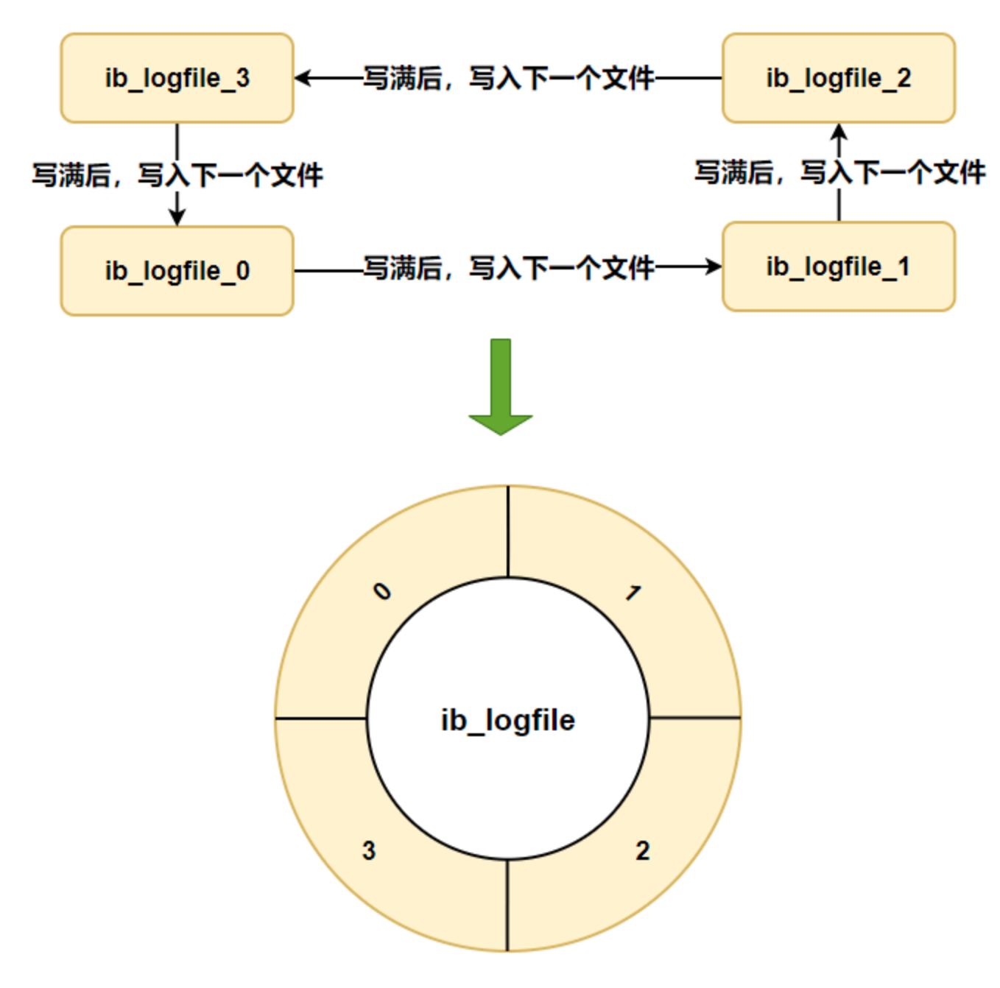
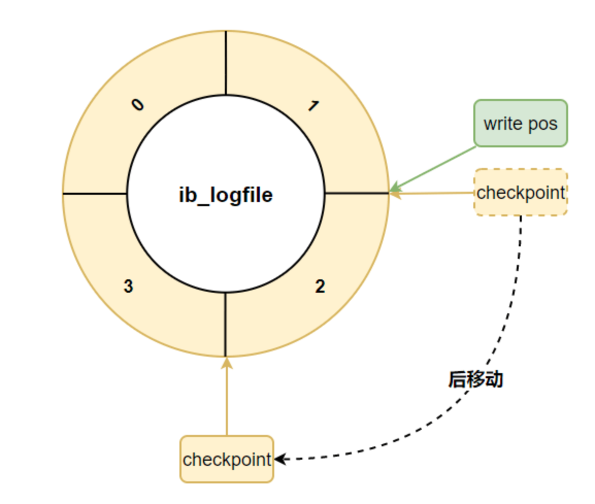
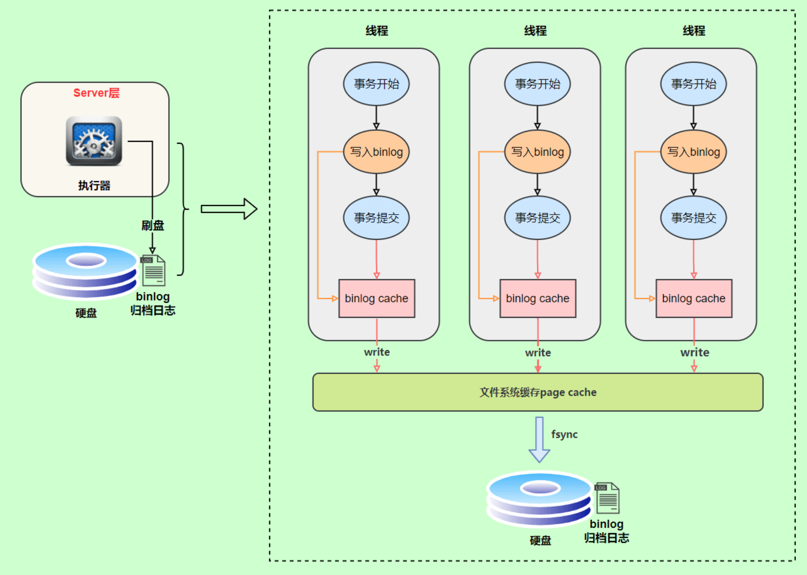

# Log
- [Log](#log)
  - [WAL机制](#wal机制)
  - [redolog \& binlog \& undolog](#redolog--binlog--undolog)
    - [redolog](#redolog)
      - [redolog 日志文件组](#redolog-日志文件组)
    - [binlog](#binlog)
      - [记录格式](#记录格式)
      - [写入机制](#写入机制)
    - [undolog](#undolog)
      - [故障恢复](#故障恢复)
      - [MVCC（Multi-Versioin Concurrency Control）](#mvccmulti-versioin-concurrency-control)
  - [删库跑路如何恢复](#删库跑路如何恢复)
  - [为什么会有 binlog 和 redolog 两份日志呢](#为什么会有-binlog-和-redolog-两份日志呢)
  - [错误日志](#错误日志)
  - [通用查询日志](#通用查询日志)

## WAL机制
WAL: Write Ahead Log 预写日志，是数据库系统中常见的一种手段，用于保证数据操作的原子性和持久性。

在计算机科学中，「预写式日志」（Write-ahead logging，缩写 WAL）是关系数据库系统中用于提供原子性和持久性（ACID 属性中的两个）的一系列技术。在使用 WAL 的系统中，所有的修改在提交之前都要先写入 log 文件中。

log 文件中通常包括 redo 和 undo 信息。这样做的目的可以通过一个例子来说明。假设一个程序在执行某些操作的过程中机器掉电了。在重新启动时，程序可能需要知道当时执行的操作是成功了还是部分成功或者是失败了。如果使用了 WAL，程序就可以检查 log 文件，并对突然掉电时计划执行的操作内容跟实际上执行的操作内容进行比较。在这个比较的基础上，程序就可以决定是撤销已做的操作还是继续完成已做的操作，或者是保持原样。

WAL 允许用 in-place 方式更新数据库。另一种用来实现原子更新的方法是 shadow paging，它并不是 in-place 方式。用 in-place 方式做更新的主要优点是减少索引和块列表的修改。ARIES 是 WAL 系列技术常用的算法。在文件系统中，WAL 通常称为 journaling。PostgreSQL 也是用 WAL 来提供 point-in-time 恢复和数据库复制特性。

WAL 机制的原理: 
- 「修改并不直接写入到数据库文件中，而是写入到另外一个称为 WAL 的文件中；如果事务失败，WAL 中的记录会被忽略，撤销修改；如果事务成功，它将在随后的某个时间被写回到数据库文件中，提交修改。

WAL 的优点
1. 读和写可以完全地并发执行，不会互相阻塞（但是写之间仍然不能并发）。
2. WAL 在大多数情况下，拥有更好的性能（因为无需每次写入时都要写两个文件）。
3. 磁盘 I/O 行为更容易被预测。
4. 使用更少的 fsync()操作，减少系统脆弱的问题。

## redolog & binlog & undolog
### redolog
redo log（重做日志）是 InnoDB 存储引擎独有的，它让 MySQL 拥有了崩溃恢复能力。比如 MySQL 实例挂了或宕机了，重启时，InnoDB 存储引擎会使用 redo log 恢复数据，保证数据的持久性与完整性。


redo log 支持顺序写，而InnoDB数据表文件ibd文件不支持顺序写，所以redo log写入速度比ibd文件快。因为顺序IO性能远高于随机IO。

数据在MySQL中存储是以页为单位，事务中的数据可能遍布在不同的页中，如果直接写入到对应的页中，是随机IO写入。

而redo log是通过顺序IO"追加"的方式写入到文件末尾，而且写入的内容也是物理日志，比如比如，某个事务将系统表空间中第10号页面中偏移量为 100 处的那个字节的值 1 改成 2等信息，日志占用空间也很小。

innodb_flush_log_at_trx_commit: 这个参数控制redo log的写入策略，有三种可能取值
- 设置为0 表示每次提交事务时都只是把 redo log 留在redo log buffer中，数据库宕机可能丢失数据
- 设置为1 表示每次事务提交时都将redo log直接持久化到磁盘，数据最安全，不会因为数据库宕机丢失数据，但是效率稍微差一些，线上系统推荐这个设置
- 设置为2 表示每次事务提交时都只是把redo log写到操作系统的缓存page cache里，这种情况如果数据库宕机时不会丢失数据的，但是操作系统如果宕机了，page cache里的数据还没来得及写入磁盘文件的话就会丢失数据

InnoDB有一个后台线程，每隔 1 秒，就会把 redo log buffer 中的日志，调用操作系统函数 write 写到文件系统的 page cache，然后调用操作系统的 fsync 持久化到磁盘文件。

#### redolog 日志文件组

- 硬盘上存储的 redo log 日志文件不只一个，而是以一个日志文件组的形式出现的，每个的redo日志文件大小都是一样的。
- 比如可以配置为一组4个文件，每个文件的大小是 1GB，整个 redo log 日志文件组可以记录4G的内容。
- 它采用的是环形数组形式，从头开始写，写到末尾又回到头循环写，如下图所示。



- 在这个日志文件组中还有两个重要的属性，分别是 write pos、checkpoint
  - write pos 是当前记录的位置，一边写一边后移
  - checkpoint 是当前要擦除的位置，也是往后推移
- 每次刷盘 redo log 记录到日志文件组中，write pos 位置就会后移更新
- 每次 MySQL 加载日志文件组恢复数据时，会清空加载过的 redo log 记录，并把 checkpoint 后移更新
- write pos 和 checkpoint 之间的还空着的部分可以用来写入新的 redo log 记录


- 如果 write pos 追上 checkpoint ，表示日志文件组满了，这时候不能再写入新的 redo log 记录，MySQL 得停下来，清空一些记录，把 checkpoint 推进一下



> MySQL 8.0.30 之前可以通过 innodb_log_files_in_group 和 innodb_log_file_size 配置日志文件组的文件数和文件大小
> 
> 但在 MySQL 8.0.30 及之后的版本中，这两个变量已被废弃，即使被指定也是用来计算 innodb_redo_log_capacity 的值。
> 
> 而日志文件组的文件数则固定为 32，文件大小则为 innodb_redo_log_capacity / 32 。

### binlog

- redo log 是物理日志，记录内容是"在某个数据页上做了什么修改"，属于 InnoDB 存储引擎。
- 而 binlog 是逻辑日志，记录内容是语句的原始逻辑，类似于"给 ID=2 这一行的 c 字段加 1"，属于MySQL Server 层。
- 不管用什么存储引擎，只要发生了表数据更新，都会产生 binlog 日志。
- 那 binlog 到底是用来干嘛的？
- 可以说 MySQL 数据库的数据备份、主备、主主、主从都离不开 binlog，需要依靠 binlog 来同步数据，保证数据一致性。
- binlog 会记录所有涉及更新数据的逻辑操作，并且是顺序写。


#### 记录格式
binlog 日志有三种格式，可以通过binlog_format参数指定。
- statement
- row
- mixed

指定statement，记录的内容是SQL语句原文，比如执行一条`update T set update_time=now() where id=1`，记录的内容如下。


同步数据时，会执行记录的SQL语句，但是有个问题，`update_time=now()`这里会获取当前系统时间，直接执行会导致与原库的数据不一致。

为了解决这种问题，我们需要指定为row，记录的内容不再是简单的SQL语句了，还包含操作的具体数据，记录内容如下。


row格式记录的内容看不到详细信息，要通过mysqlbinlog工具解析出来。

`update_time=now()`变成了具体的时间`update_time=1627112756247`，条件后面的@1、@2、@3 都是该行数据第 1 个~3 个字段的原始值（假设这张表只有 3 个字段）。

这样就能保证同步数据的一致性，通常情况下都是指定为row，这样可以为数据库的恢复与同步带来更好的可靠性。

但是这种格式，需要更大的容量来记录，比较占用空间，恢复与同步时会更消耗 IO 资源，影响执行速度。

所以就有了一种折中的方案，指定为mixed，记录的内容是前两者的混合。

MySQL 会判断这条SQL语句是否可能引起数据不一致，如果是，就用row格式，否则就用statement格式。

#### 写入机制

binlog 的写入时机也非常简单，事务执行过程中，先把日志写到binlog cache，事务提交的时候，再把binlog cache写到 binlog 文件中。

因为一个事务的 binlog 不能被拆开，无论这个事务多大，也要确保一次性写入，所以系统会给每个线程分配一个块内存作为binlog cache。

我们可以通过binlog_cache_size参数控制单个线程 binlog cache 大小，如果存储内容超过了这个参数，就要暂存到磁盘（Swap）。

binlog 日志刷盘流程如下:



- 上图的 write，是指把日志写入到文件系统的 page cache，并没有把数据持久化到磁盘，所以速度比较快
- 上图的 fsync，才是将数据持久化到磁盘的操作

write和fsync的时机，可以由参数sync_binlog控制，默认是1。

为0的时候，表示每次提交事务都只write，由系统自行判断什么时候执行fsync。虽然性能得到提升，但是机器宕机，page cache里面的 binlog 会丢失。

为了安全起见，可以设置为1，表示每次提交事务都会执行fsync，就如同 redo log 日志刷盘流程 一样。

最后还有一种折中方式，可以设置为N(N>1)，表示每次提交事务都write，但累积N个事务后才fsync。

在出现 IO 瓶颈的场景里，将sync_binlog设置成一个比较大的值，可以提升性能。

同样的，如果机器宕机，会丢失最近N个事务的 binlog 日志。

### undolog

undo log 用来记录每次修改之前的历史值，配合 redo log 用于故障恢复。

#### 故障恢复

在设计数据库时，我们假设数据库可能在任何时刻，由于如硬件故障，软件Bug，运维操作等原因突然崩溃。这个时候尚未完成提交的事务可能已经有部分数据写入了磁盘，如果不加处理，会违反数据库对Atomic的保证，也就是任何事务的修改要么全部提交，要么全部取消。针对这个问题，直观的想法是等到事务真正提交时，才能允许这个事务的任何修改落盘，也就是No-Steal策略。显而易见，这种做法一方面造成很大的内存空间压力，另一方面提交时的大量随机IO会极大的影响性能。因此，数据库实现中通常会在正常事务进行中，就不断的连续写入Undo Log，来记录本次修改之前的历史值。当Crash真正发生时，可以在Recovery过程中通过回放Undo Log将未提交事务的修改抹掉。InnoDB采用的就是这种方式。

既然已经有了在Crash Recovery时支持事务回滚的Undo Log，自然地，在正常运行过程中，死锁处理或用户请求的事务回滚也可以利用这部分数据来完成。

#### MVCC（Multi-Versioin Concurrency Control）

为了避免只读事务与写事务之间的冲突，避免写操作等待读操作，几乎所有的主流数据库都采用了多版本并发控制（MVCC）的方式，也就是为每条记录保存多份历史数据供读事务访问，新的写入只需要添加新的版本即可，无需等待。InnoDB在这里复用了Undo Log中已经记录的历史版本数据来满足MVCC的需求。

## 删库跑路如何恢复
如果要恢复大量数据，比如程序员经常说的**删库跑路**话题。假设我们把数据库所有数据都删了如何恢复。

如果数据库之前没有备份，但所有的 binlog日志都在的话，可以从 binlog 第一个文件开始逐个恢复每个 binlog 文件里的数据，这种一般不太可能，因为 binlog 日志比较大，早期的 binlog 会定期删除。

所以一般不可能完全用 binlog 恢复整个数据库。

一般我们推荐每天（如在每日凌晨）做一次全量备份。那么恢复数据库时就可以通过最近一次全量备份再加上备份时间之后的 binlog 来恢复数据。

备份脚本示例: 
```shell
# 备份整库
mysqldump -u root 数据库名 >备份文件名

# 备份整表
mysqldump -u root 数据库名 表名 >备份文件名

# 通过备份文件恢复
# 恢复整库，需要自己先根据数据库名建一个数据库
mysql -u root 数据库名 <备份文件名
```

## 为什么会有 binlog 和 redolog 两份日志呢
因为最开始 MySQL 没有 InnoDB 引擎。MySQL自带的引擎是 MyISAM，但是 MyISAM 没有 Crash-Safe 能力，binlog 日志只能用于归档。

而 InnoDB 是另一个公司以插件形式引入 MySQL 的，既然只依赖 binlog 没有 Crash-Safe 能力，所以 InnoDB 使用了另一套日志系统 —— 也就是 redolog 来实现 Crash-Safe 能力。

有了 redolog，InnoDB就可以保证即使数据库发生异常重启，之前提交的记录都不会丢失，这个能力称为 Crash-Safe。

## 错误日志
MySQL 还有一个比较重要的日志是错误日志。错误日志记录了数据库启动和停止，以及运行过程中发生任何严重错误时的相关信息。当数据库出现故障导致无法正常使用时，都建议首先查看此日志。

在 MySQL 数据库中，错误日志功能是默认开启的，且无法关闭。
```SQL
# 查看错误日志存放位置
show variables like '%log_error%'
```

## 通用查询日志

通用查询日志记录用户的所有操作，包括启动和关闭 MySQL 服务、所有用户的连接开启和结束时间、发给 MySQL 数据库服务器的所有 SQL 指令等，如 select、show 等，无论 SQL 的语法正确还是错误，也无论 SQL 执行成功还是失败，MySQL 都会记录起来。

通用查询日志用来还原操作时的具体场景，可以帮助我们准确定位一些疑难问题，比如重复支付等问题。

- general_log 是否开启日志参数，默认 OFF 关闭，因为开启会占用大量资源所以一般不建议开启，只在需要调试问题时开启。
- general_log_file 通用查询日志记录的位置参数
```SQL
show variables like '%general_log%';

# 打开通用查询日志
SET GLOBAL general_log=on;
```
