# 思维导图

```plantuml
@startmindmap
* MySQL数据库
** 架构体系
*** Server层
**** 连接器
***** 权限校验
***** 连接管理
***** 长连接+连接池
**** 查询缓存
***** 5.8版本后废弃
***** 命中率低
**** 分析器
***** 词法分析(Lexer)
***** 语法分析(Parser)
**** 优化器
***** 基于代价模型
***** 索引选择
***** JOIN顺序确定
***** 子查询执行策略
**** 执行器
***** 函数预执行
***** 权限检查
***** 存储引擎交互
*** 存储引擎层
**** InnoDB
***** 支持事务
***** 行锁支持
***** 外键约束
***** BufferPool缓存
***** redolog/undolog
**** MyISAM
***** 不支持事务
***** 表锁
***** 实现较早

** 索引系统
*** 数据结构
**** B+树(InnoDB)
***** 非叶子节点不存数据
***** 叶子节点双向链表
***** 支持范围查询
**** Hash索引
***** 等值查询高效
***** 不支持范围查询
***** 存在Hash冲突
*** 索引类型
**** 聚簇索引
***** 数据文件本身就是索引
***** 推荐整型自增主键
**** 非聚簇索引
***** 索引文件与数据文件分离
**** 联合索引
***** 最左前缀原则
***** 减少开销
***** 提高效率
*** 存储引擎差异
**** MyISAM
***** .frm表定义
***** .MYI索引文件
***** .MYD数据文件
**** InnoDB
***** .ibd数据文件
***** 聚簇索引结构

** 事务机制
*** ACID特性
**** 原子性(Atomicity)
***** undo log实现
**** 一致性(Consistency)
***** 业务逻辑+其他特性
**** 隔离性(Isolation)
***** 锁机制+MVCC
**** 持久性(Durability)
***** redo log实现
*** 隔离级别
**** RU(读未提交)
**** RC(读已提交)
***** 解决脏读
**** RR(可重复读)
***** 解决不可重复读
***** MySQL默认级别
**** Serializable(串行)
***** 解决幻读
*** MVCC机制
**** ReadView
***** RC: 语句级快照
***** RR: 事务级快照
**** 快照读vs当前读
***** 快照读: 普通SELECT
***** 当前读: 加锁SELECT/DML
**** 事务ID分配
***** 首次修改操作时分配

** 锁机制
*** 按操作类型
**** 读锁(共享锁/S锁)
***** LOCK IN SHARE MODE
**** 写锁(排他锁/X锁)
***** FOR UPDATE
***** DML操作
*** 按粒度划分
**** 全局锁
***** 全库逻辑备份
**** 表锁
***** 锁整张表
***** 并发度低
**** 行锁
***** InnoDB支持
***** 并发度高
***** 可能升级为表锁
**** 页锁
***** InnoDB不支持
*** 按机制划分
**** 乐观锁
***** CAS算法
***** 版本号机制
**** 悲观锁
***** 传统锁机制
*** InnoDB行锁算法
**** 记录锁(Record Lock)
***** 锁定具体行记录
**** 间隙锁(Gap Lock)
***** 锁定索引间隙
***** 防止幻读
***** 仅RR级别有效
**** 临键锁(Next-Key Lock)
***** 记录锁+间隙锁
***** 左开右闭区间
*** 锁升级场景
**** 无索引条件
**** 索引失效
**** 全表扫描

** 日志系统
*** WAL机制
**** Write Ahead Log
**** 预写日志
**** 保证原子性和持久性
*** 三大日志
**** redo log(重做日志)
***** InnoDB存储引擎
***** 物理日志
***** 循环写入
***** 崩溃恢复
***** innodb_flush_log_at_trx_commit参数
****** 0: buffer中
****** 1: 直接持久化(推荐)
****** 2: page cache
**** binlog(归档日志)
***** Server层
***** 逻辑日志
***** 数据备份
***** 主从复制
***** 记录格式
****** statement: SQL原文
****** row: 具体数据变化
****** mixed: 混合模式
***** sync_binlog参数控制刷盘
**** undo log(回滚日志)
***** 事务回滚
***** MVCC实现
***** 故障恢复
*** 两阶段提交
**** 保证redo log和binlog一致性
**** 崩溃恢复判断规则
*** 其他日志
**** 错误日志
***** 默认开启
***** 故障诊断
**** 通用查询日志
***** 记录所有操作
***** 调试使用
***** 默认关闭

** 性能优化
*** Explain执行计划
**** 核心字段
***** id: 执行顺序
***** select_type: 查询类型
***** table: 表名
***** type: 连接类型
****** system > const > eq_ref > ref > range > index > ALL
***** key: 实际使用索引
***** rows: 预估扫描行数
***** Extra: 额外信息
**** 优化策略
***** 避免全表扫描
****** 创建合理索引
****** 避免函数包装列
****** 合理选择驱动表
***** 消除文件排序
****** 为排序字段创建索引
****** 联合索引覆盖ORDER BY
***** 避免临时表
****** 使用索引覆盖
****** 查询重写
***** 覆盖索引构建
*** SQL优化
**** IN vs EXISTS
***** IN: 内表驱动外表
***** EXISTS: 外表驱动内表
***** NOT EXISTS优于NOT IN
**** 索引失效场景
***** 函数包装
***** 类型转换
***** 最左前缀原则违反
***** LIKE以%开头

** 系统配置
*** 连接参数
**** max_connections
**** max_user_connections
**** interactive_timeout
*** InnoDB参数
**** innodb_buffer_pool_size
***** 物理内存60%-70%
**** innodb_thread_concurrency
**** innodb_lock_wait_timeout
*** 性能监控
**** 缓冲池命中率
**** 平均读取字节数
**** innodb状态变量
@endmindmap
```

# 🎯 核心知识点

- **架构设计**: Server层与存储引擎层的分离设计
- **索引优化**: B+树结构、聚簇索引、联合索引的最左前缀原则
- **事务ACID**: 通过redo log、undo log、锁机制、MVCC实现
- **锁机制**: 从全局锁到行锁，记录锁、间隙锁、临键锁的应用
- **日志系统**: WAL机制下的redo log、binlog、undo log协同工作
- **性能调优**: 通过Explain分析执行计划，避免全表扫描和文件排序
