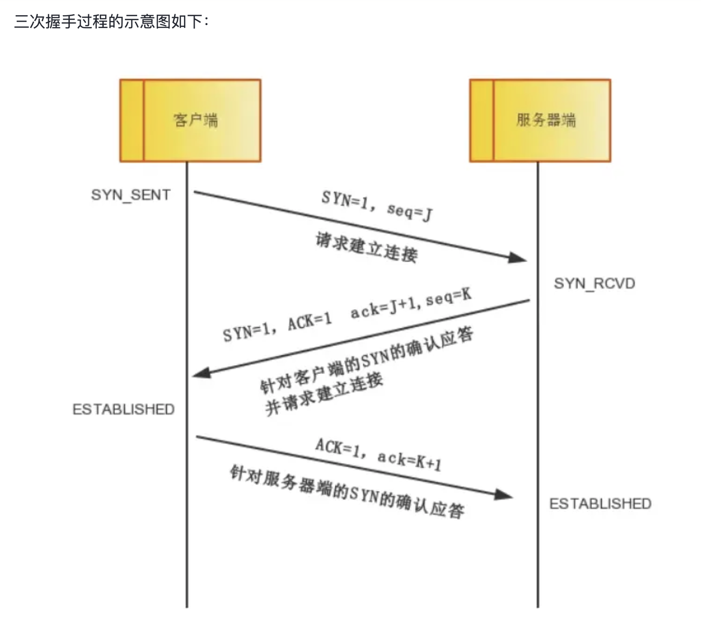
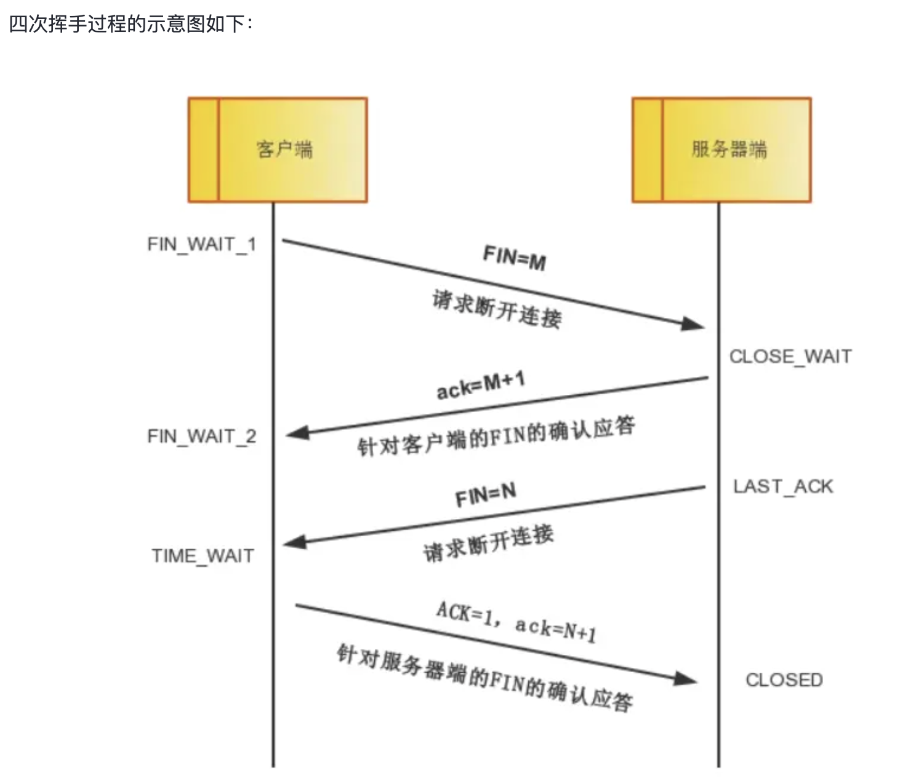

# TCP Connection
- [TCP Connection](#tcp-connection)
  - [介绍](#介绍)
  - [TCP 状态转换](#tcp-状态转换)
  - [TCP 各种标志位](#tcp-各种标志位)
  - [TCP 三次握手四次挥手](#tcp-三次握手四次挥手)
    - [三次握手](#三次握手)
    - [四次挥手](#四次挥手)

## 介绍

TCP 连接有多种状态，常见状态有:

- LISTENING
  - 监听来自远方的 TCP 端口的连接请求
- CLOSE_WAIT
  - 等待从本地来的连接中断请求
  - 被动关闭方收到FIN报文后，发送ACK确认，但本地应用程序还没有关闭连接，等待应用程序向操作系统发送关闭请求
- TIME_WAIT
  - 等待足够的时间以确保远程 TCP 接收到连接中断请求的确认
  - 主动关闭方在发送最后一个ACK后，进入此状态，等待足够的时间（通常是2MSL），以确保对方收到了最后的ACK，并防止在重用相同端口时出现旧数据包的干扰。
- ESTABLISHED
  - 代表一个打开的连接

> MSL: Maximum Segment Lifetime
> - TCP的MSL（Maximum Segment Lifetime，最大报文生存时间）是指一个TCP报文段在网络上能够存在的最长时间。
> - 它是一个时间参数，超过这个时间，网络中的TCP报文段就会被丢弃。在TCP连接关闭时，处于TIME_WAIT状态的一端会等待2MSL的时间，以确保所有可能在网络中滞留的旧报文段都能消失，从而避免对新建立的连接造成干扰。
>
> MTU: Maximum Transmission Unit
> - 最大传输单元，是指一种通信协议的某一层上面所能通过的最大数据包大小（以字节为单位）。最大传输单元这个参数通常与通信接口有关（网络接口卡、串口等）。例如：Ethernet所能接收最大数据帧是1518字节，MTU=1500。实际上，这个最大传输单元常被限制为MTU-46，这是因为当IP层使用IP进行数据传输的时候，往往会将上层传下来的数据进行分割，然后按照IP头+数据的格式，向下发送。因此，为了保证上下层之间传输的兼容性，上层的数据包大小必须受到一定的限制，而这个限制就是MTU。

其余的状态:
- CLOSED
  - 没有任何连接状态
- FIN_WAIT_1
  - 等待远程 TCP 的连接中断请求，或先前的连接中断请求的确认
- FIN_WAIT_2
  - 从远程 TCP 等待连接中断请求
- SYN_SENT
  - 已发送了 SYN 连接请求
- SYN_RCVD
  - 收到一个连接请求，同时也已发送了连接请求
- CLOSING
  - 等待远程 TCP 对连接中断的确认
- LAST_ACK
  - 等待原来的连接中断请求的确认（和 CLOSE_WAIT 相对）

主动端可能出现的状态: FIN_WAIT1, FIN_WAIT2, CLOSING, TIME_WAIT

被动端可能出现的状态: CLOSE_WAIT, LAST_ACK, TIME_WAIT

## TCP 状态转换

客户端的状态可以用如下的流程表示:

CLOSED -> SYN_SENT -> ESTABLISHED -> FIN_WAIT_1 -> FIN_WAIT_2 -> TIME_WAIT -> CLOSED

服务端的状态可以用如下的流程表示:

CLOSED -> LISTEN -> SYN_RCVD -> ESTABLISHED -> CLOSE_WAIT -> LAST_ACK -> CLOSED

## TCP 各种标志位

TCP的标志位每个TCP段都有一个目的，这是借助于TCP标志位选项来确定的，允许发送方或接收方指定哪些标志应该被使用，以便段被另一端正确处理。用的最广泛的标志是 SYN，ACK 和 FIN，用于建立连接，确认成功的段传输，最后终止连接。

- SYN: 简写为S，同步标志位，用于建立会话连接，同步序列号；
- ACK: 简写为.，确认标志位，对已接收的数据包进行确认；
- FIN: 简写为F，完成标志位，表示我已经没有数据要发送了，即将关闭连接；
- PSH: 简写为P，推送标志位，表示该数据包被对方接收后应立即交给上层应用，而不在缓冲区排队；
- RST: 简写为R，重置标志位，用于连接复位、拒绝错误和非法的数据包；
- URG: 简写为U，紧急标志位，表示数据包的紧急指针域有效，用来保证连接不被阻断，并督促中间设备尽快处理；

## TCP 三次握手四次挥手

### 三次握手

- 第一次握手
  - 客户端将TCP报文标志位SYN置为1，随机产生一个序号值seq=J，保存在TCP首部的序列号(Sequence Number)字段里，指明客户端打算连接的服务器的端口，并将该数据包发送给服务器端，发送完毕后，客户端进入SYN_SENT状态，等待服务器端确认。
- 第二次握手
  - 服务器端收到数据包后由标志位SYN=1知道客户端请求建立连接，服务器端将TCP报文标志位SYN和ACK都置为1，ack=J+1，随机产生一个序号值seq=K，并将该数据包发送给客户端以确认连接请求，服务器端进入SYN_RCVD状态。
- 第三次握手
  - 客户端收到确认后，检查ack是否为J+1，ACK是否为1，如果正确则将标志位ACK置为1，ack=K+1，并将该数据包发送给服务器端，服务器端检查ack是否为K+1，ACK是否为1，如果正确则连接建立成功，客户端和服务器端进入ESTABLISHED状态，完成三次握手，随后客户端与服务器端之间可以开始传输数据了。

注意:我们上面写的ack和ACK，不是同一个概念：
- 小写的ack代表的是头部的确认号Acknowledge number， 缩写ack，是对上一个包的序号进行确认的号，ack=seq+1。
- 大写的ACK，则是我们上面说的TCP首部的标志位，用于标志的TCP包是否对上一个包进行了确认操作，如果确认了，则把ACK标志位设置成1。

### 四次挥手

挥手请求可以是Client端，也可以是Server端发起的，我们假设是Client端发起
- 第一次挥手
  - Client端发起挥手请求，向Server端发送标志位是FIN报文段，设置序列号seq，此时，Client端进入FIN_WAIT_1状态，这表示Client端没有数据要发送给Server端了。
- 第二次分手
  - Server端收到了Client端发送的FIN报文段，向Client端返回一个标志位是ACK的报文段，ack设为seq加1，Client端进入FIN_WAIT_2状态，Server端告诉Client端，我确认并同意你的关闭请求。
- 第三次分手
  - Server端向Client端发送标志位是FIN的报文段，请求关闭连接，同时Client端进入LAST_ACK状态。
- 第四次分手
  - Client端收到Server端发送的FIN报文段，向Server端发送标志位是ACK的报文段，然后Client端进入TIME_WAIT状态。Server端收到Client端的ACK报文段以后，就关闭连接。此时，Client端等待2MSL的时间后依然没有收到回复，则证明Server端已正常关闭，那好，Client端也可以关闭连接了。

> **为什么要等待2MSL？**
> 
> MSL：报文段最大生存时间，它是任何报文段被丢弃前在网络内的最长时间。有以下两个原因
> 
> - 第一点：**保证TCP协议的全双工连接能够可靠关闭**
>   - 由于IP协议的不可靠性或者是其它网络原因，导致了Server端没有收到Client端的ACK报文，那么Server端就会在超时之后重新发送FIN，如果此时Client端的连接已经关闭处于CLOESD状态，那么重发的FIN就找不到对应的连接了，从而导致连接错乱，所以，Client端发送完最后的ACK不能直接进入CLOSED状态，而要保持TIME_WAIT，当再次收到FIN的收，能够保证对方收到ACK，最后正确关闭连接。
> - 第二点：**保证这次连接的重复数据段从网络中消失**
>   - 如果Client端发送最后的ACK直接进入CLOSED状态，然后又再向Server端发起一个新连接，这时不能保证新连接的与刚关闭的连接的端口号是不同的，也就是新连接和老连接的端口号可能一样了，那么就可能出现问题：如果前一次的连接某些数据滞留在网络中，这些延迟数据在建立新连接后到达Client端，由于新老连接的端口号和IP都一样，TCP协议就认为延迟数据是属于新连接的，新连接就会接收到脏数据，这样就会导致数据包混乱。所以TCP连接需要在TIME_WAIT状态等待2倍MSL，才能保证本次连接的所有数据在网络中消失。

> **为什么连接的时候是三次握手，关闭的时候却是四次握手？**
> 
> 建立连接时因为当Server端收到Client端的SYN连接请求报文后，可以直接发送SYN+ACK报文。其中ACK报文是用来应答的，SYN报文是用来同步的。所以建立连接只需要三次握手。
> 
> 由于TCP协议是一种面向连接的、可靠的、基于字节流的运输层通信协议，TCP是全双工模式。这就意味着，关闭连接时，当Client端发出FIN报文段时，只是表示Client端告诉Server端数据已经发送完毕了。当Server端收到FIN报文并返回ACK报文段，表示它已经知道Client端没有数据发送了，但是Server端还是可以发送数据到Client端的，所以Server很可能并不会立即关闭SOCKET，直到Server端把数据也发送完毕。
> 
> 当Server端也发送了FIN报文段时，这个时候就表示Server端也没有数据要发送了，就会告诉Client端，我也没有数据要发送了，之后彼此就会愉快的中断这次TCP连接。

