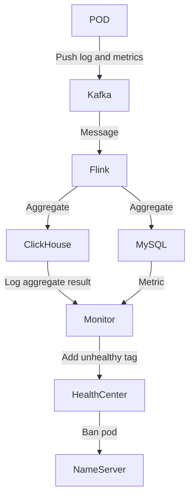
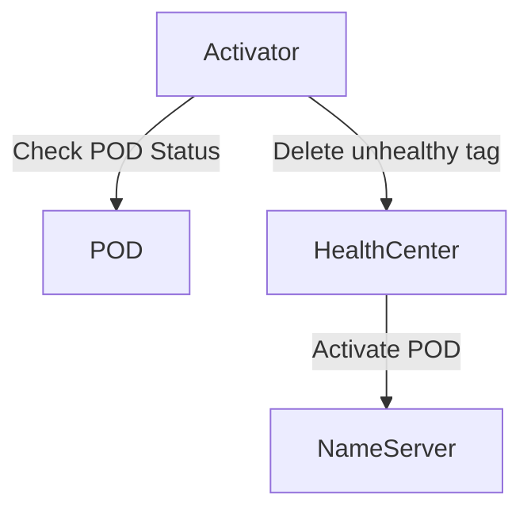

# Monischeduler

## Ban Server Procedure



## Activate Server Procedure



## How Flink Write Analysis Result to MySQL/ClickHouse
Use JdbcSink to write data to MySQL/ClickHouse:

**keyword: JdbcSink.sink / JdbcSink.exactlyOnceSink**

**sink**:
```java
public class JdbcSinkExample {

    static class Book {
        public Book(Long id, String title, String authors, Integer year) {
            this.id = id;
            this.title = title;
            this.authors = authors;
            this.year = year;
        }
        final Long id;
        final String title;
        final String authors;
        final Integer year;
    }

    public static void main(String[] args) throws Exception {
        var env = StreamExecutionEnvironment.getExecutionEnvironment();

        env.fromElements(
                new Book(101L, "Stream Processing with Apache Flink", "Fabian Hueske, Vasiliki Kalavri", 2019),
                new Book(102L, "Streaming Systems", "Tyler Akidau, Slava Chernyak, Reuven Lax", 2018),
                new Book(103L, "Designing Data-Intensive Applications", "Martin Kleppmann", 2017),
                new Book(104L, "Kafka: The Definitive Guide", "Gwen Shapira, Neha Narkhede, Todd Palino", 2017)
        ).addSink(
                JdbcSink.sink(
                        "insert into books (id, title, authors, year) values (?, ?, ?, ?)",
                        (statement, book) -> {
                            statement.setLong(1, book.id);
                            statement.setString(2, book.title);
                            statement.setString(3, book.authors);
                            statement.setInt(4, book.year);
                        },
                        JdbcExecutionOptions.builder()
                                .withBatchSize(1000)
                                .withBatchIntervalMs(200)
                                .withMaxRetries(5)
                                .build(),
                        new JdbcConnectionOptions.JdbcConnectionOptionsBuilder()
                                .withUrl("jdbc:postgresql://dbhost:5432/postgresdb")
                                .withDriverName("org.postgresql.Driver")
                                .withUsername("someUser")
                                .withPassword("somePassword")
                                .build()
                ));
                
        env.execute();
    }
}
```

**ExactlyOnceSink**:
```java
StreamExecutionEnvironment env = StreamExecutionEnvironment.getExecutionEnvironment();
env
    .fromElements(...)
    .addSink(
        JdbcSink.exactlyOnceSink(
            "insert into books (id, title, author, price, qty) values (?,?,?,?,?)",
            (ps, t) -> {
                ps.setInt(1, t.id);
                ps.setString(2, t.title);
                ps.setString(3, t.author);
                ps.setDouble(4, t.price);
                ps.setInt(5, t.qty);
            },
            JdbcExecutionOptions.builder()
                .withMaxRetries(0)
                .build(),
            JdbcExactlyOnceOptions.defaults(),
            () -> {
                // create a driver-specific XA DataSource
                // The following example is for derby 
                EmbeddedXADataSource ds = new EmbeddedXADataSource();
                ds.setDatabaseName("my_db");
                return ds;
            }
        )
    );
env.execute();
```