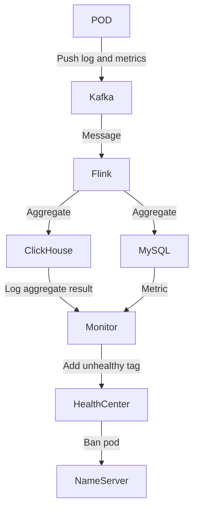
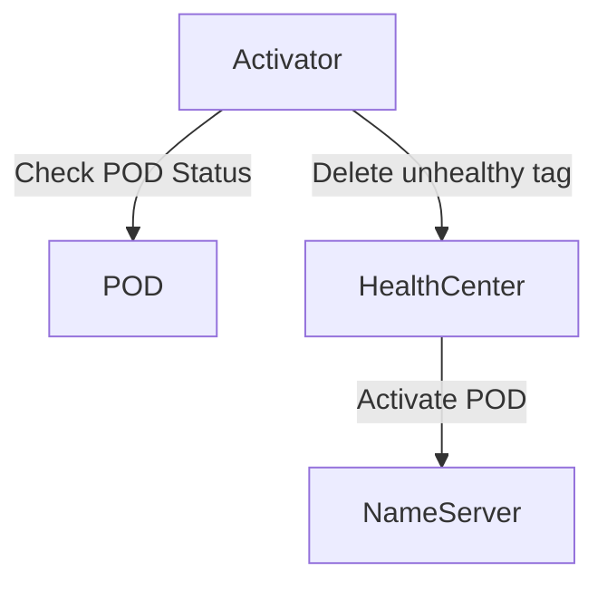

# Monischeduler

## Ban Server Procedure

```mermaid
graph TD
    Kafka
    Flink
    MySQL
    ClickHouse
    POD
    Monitor
    HealthCenter
    NameServer

    POD --> |Push log and metrics| Kafka;
    Kafka --> |Message| Flink;
    Flink --> |Aggregate| MySQL;
    Flink --> |Aggregate| ClickHouse;
    ClickHouse --> |Log aggregate result| Monitor;
    MySQL --> |Metric| Monitor;
    Monitor --> |Add unhealthy tag| HealthCenter;
    HealthCenter --> |Ban pod| NameServer;
```

## Activate Server Procedure

```mermaid
graph TD
    POD
    Activator
    HealthCenter
    NameServer

    Activator --> |Check POD Status| POD;
    Activator --> |Delete unhealthy tag| HealthCenter;
    HealthCenter --> |Activate POD| NameServer;
```
