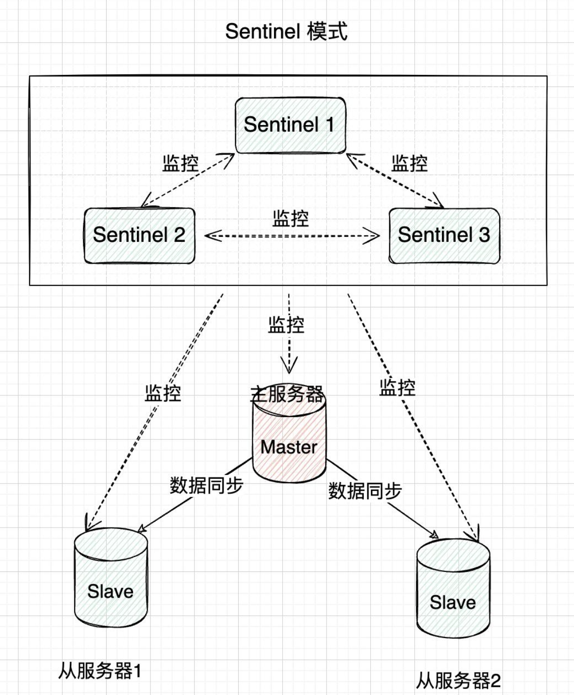
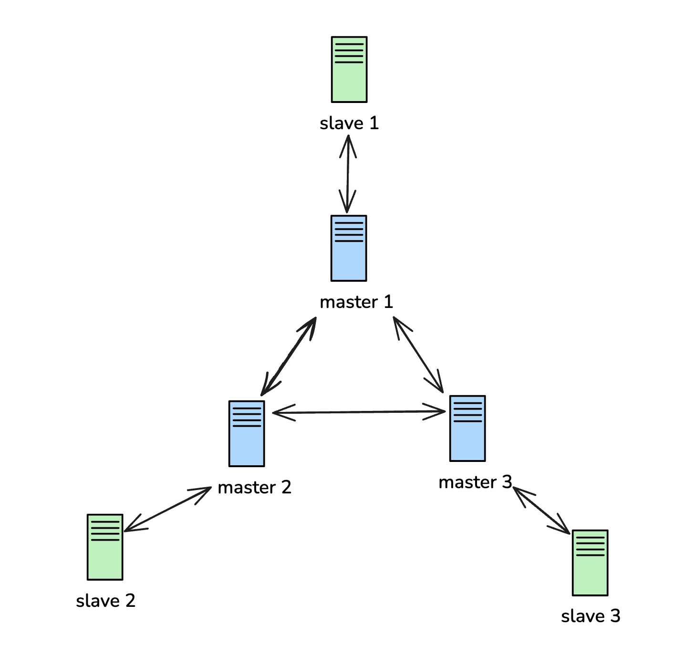

# Replication
- [Replication](#replication)
  - [主从复制](#主从复制)
    - [主从复制原理](#主从复制原理)
    - [主从复制的缺点](#主从复制的缺点)
  - [哨兵模式](#哨兵模式)
    - [哨兵模式的优缺点](#哨兵模式的优缺点)
    - [哨兵模式场景应用](#哨兵模式场景应用)
  - [集群模式](#集群模式)
    - [数据分片与槽位](#数据分片与槽位)
    - [Cluster模式的优缺点](#cluster模式的优缺点)

## 主从复制
主从复制，是指将一台Redis服务器的数据，复制到其他的Redis服务器。前者称为主节点(master)，后者称为从节点(slave)；数据的复制是单向的，只能由主节点到从节点。

主从复制的作用主要包括：
- **数据冗余**：主从复制实现了数据的热备份，是持久化之外的一种数据冗余方式。
- **故障恢复**：当主节点出现问题时，可以由从节点提供服务，实现快速的故障恢复；实际上是一种服务的冗余。
- **负载均衡**：在主从复制的基础上，配合读写分离，可以由主节点提供写服务，由从节点提供读服务（即写Redis数据时应用连接主节点，读Redis数据时应用连接从节点），分担服务器负载；尤其是在写少读多的场景下，通过多个从节点分担读负载，可以大大提高Redis服务器的并发量。
- **高可用基石**：除了上述作用以外，主从复制还是哨兵和集群能够实施的基础，因此说主从复制是Redis高可用的基础。

主从库之间采用的是读写分离的方式。
- 读操作：主库、从库都可以接收；
- 写操作：首先到主库执行，然后，主库将写操作同步给从库。

### 主从复制原理
**注意**：在2.8版本之前只有全量复制，而2.8版本后有全量和增量复制：
- 全量（同步）复制：比如第一次同步时
- 增量（同步）复制：只会把主从库网络断连期间主库收到的命令，同步给从库

### 主从复制的缺点
主从复制的缺点
- 复制延时、信号衰减
  - 所有写操作都是在主节点操作，然后同步到从节点，所以一定会有延迟
  - 系统繁忙或从节点增加时，延迟会更严重
- master高可用问题
  - 主节点挂了，从节点不会自动切换成主节点，只能等待人工干预
  - 后续哨兵集群机制可以解决这个问题
- 从数据安全性的问题，主从复制牺牲了服务高可用，增加了数据安全性

## 哨兵模式
哨兵模式是在主从复制基础上加入了哨兵节点，实现了自动故障转移。哨兵节点是一种特殊的Redis节点，它会监控主节点和从节点的运行状态。当主节点发生故障时，哨兵节点会自动从从节点中选举出一个新的主节点，并通知其他从节点和客户端，实现故障转移。

### 哨兵模式的优缺点
优点：
- 自动故障转移，提高系统的高可用性。
- 具有主从复制模式的所有优点，如数据冗余和读写分离。

缺点：
- 配置和管理相对复杂。
- 依然无法实现数据分片，受单节点内存限制。

### 哨兵模式场景应用
哨兵模式适用于以下场景：

- 高可用性要求较高的场景：通过自动故障转移，确保服务的持续可用。
- 数据备份和容灾恢复：在主从复制的基础上，提供自动故障转移功能。

> 总结：哨兵模式在主从复制模式的基础上实现了自动故障转移，提高了系统的高可用性。然而，它仍然无法实现数据分片。如果需要实现数据分片和负载均衡，可以考虑使用Cluster模式。

## 集群模式
Cluster模式是Redis的一种高级集群模式，它通过数据分片和分布式存储实现了负载均衡和高可用性。在Cluster模式下，Redis将所有的键值对数据分散在多个节点上。每个节点负责一部分数据，称为槽位。通过对数据的分片，Cluster模式可以突破单节点的内存限制，实现更大规模的数据存储。

Redis底层使用Gossip协议

### 数据分片与槽位
Redis Cluster将数据分为16384个槽位，每个节点负责管理一部分槽位。当客户端向Redis Cluster发送请求时，Cluster会根据键的哈希值将请求路由到相应的节点。具体来说，Redis Cluster使用CRC16算法计算键的哈希值，然后对16384取模，得到槽位编号。

### Cluster模式的优缺点
优点：
- 数据分片，实现大规模数据存储。
- 负载均衡，提高系统性能。
- 自动故障转移，提高高可用性。

缺点：
- 配置和管理较复杂。
- 一些复杂的多键操作可能受到限制。
