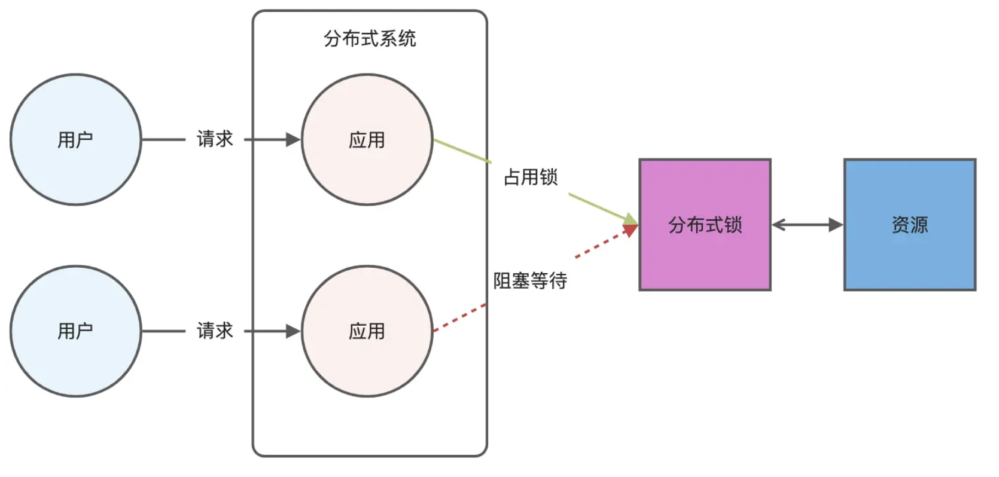

# Experience
- [Experience](#experience)
  - [分布式锁](#分布式锁)
    - [Redis 的 RedLock](#redis-的-redlock)
    - [Zookeeper 实现分布式锁](#zookeeper-实现分布式锁)
    - [对比 ZK 和 Redis](#对比-zk-和-redis)
  - [Redis 缓存双写不一致](#redis-缓存双写不一致)
  - [](#)

## 分布式锁
分布式锁是用于分布式环境下并发控制的一种机制，用于控制某个资源在同一时刻只能被一个应用所使用。如下图所示：



Redis 本身可以被多个客户端共享访问，正好就是一个共享存储系统，可以用来保存分布式锁，而且 Redis 的读写性能高，可以应对高并发的锁操作场景。

Redis 的 SET 命令有个 NX 参数可以实现「key不存在才插入」，所以可以用它来实现分布式锁：
- 如果 key 不存在，则显示插入成功，可以用来表示加锁成功；
- 如果 key 存在，则会显示插入失败，可以用来表示加锁失败。

基于 Redis 节点实现分布式锁时，对于加锁操作，我们需要满足三个条件。
- 加锁包括了读取锁变量、检查锁变量值和设置锁变量值三个操作，但需要以原子操作的方式完成，所以，我们使用 SET 命令带上 NX 选项来实现加锁；
- 锁变量需要设置过期时间，以免客户端拿到锁后发生异常，导致锁一直无法释放，所以，我们在 SET 命令执行时加上 EX/PX 选项，设置其过期时间；
- 锁变量的值需要能区分来自不同客户端的加锁操作，以免在释放锁时，出现误释放操作，所以，我们使用 SET 命令设置锁变量值时，每个客户端设置的值是一个唯一值，用于标识客户端；

满足这三个条件的分布式命令如下：
```shell
SET lock_key unique_value NX PX 10000 
```
- lock_key 就是 key 键；
- unique_value 是客户端生成的唯一的标识，区分来自不同客户端的锁操作；
- NX 代表只在 lock_key 不存在时，才对 lock_key 进行设置操作；
- PX 10000 表示设置 lock_key 的过期时间为 10s，这是为了避免客户端发生异常而无法释放锁。

而解锁的过程就是将 lock_key 键删除（del lock_key），但不能乱删，要保证执行操作的客户端就是加锁的客户端。所以，解锁的时候，我们要先判断锁的 unique_value 是否为加锁客户端，是的话，才将 lock_key 键删除。

可以看到，解锁是有两个操作，这时就需要 Lua 脚本来保证解锁的原子性，因为 Redis 在执行 Lua 脚本时，可以以原子性的方式执行，保证了锁释放操作的原子性。

```lua
// 释放锁时，先比较 unique_value 是否相等，避免锁的误释放
if redis.call("get",KEYS[1]) == ARGV[1] then
    return redis.call("del",KEYS[1])
else
    return 0
end
```

这样一来，就通过使用 SET 命令和 Lua 脚本在 Redis 单节点上完成了分布式锁的加锁和解锁。

基于 Redis 实现分布式锁的优点：

1. 性能高效（这是选择缓存实现分布式锁最核心的出发点）。
2. 实现方便。很多研发工程师选择使用 Redis 来实现分布式锁，很大成分上是因为 Redis 提供了 setnx 方法，实现分布式锁很方便。
3. 避免单点故障（因为 Redis 是跨集群部署的，自然就避免了单点故障）。

基于 Redis 实现分布式锁的缺点：

- 超时时间不好设置。如果锁的超时时间设置过长，会影响性能，如果设置的超时时间过短会保护不到共享资源。比如在有些场景中，一个线程 A 获取到了锁之后，由于业务代码执行时间可能比较长，导致超过了锁的超时时间，自动失效，注意 A 线程没执行完，后续线程 B 又意外的持有了锁，意味着可以操作共享资源，那么两个线程之间的共享资源就没办法进行保护了。
  - 那么如何合理设置超时时间呢？ 我们可以基于续约的方式设置超时时间：先给锁设置一个超时时间，然后启动一个守护线程，让守护线程在一段时间后，重新设置这个锁的超时时间。实现方式就是：写一个守护线程，然后去判断锁的情况，当锁快失效的时候，再次进行续约加锁，当主线程执行完成后，销毁续约锁即可，不过这种方式实现起来相对复杂。
- Redis 主从复制模式中的数据是异步复制的，这样导致分布式锁的不可靠性。如果在 Redis 主节点获取到锁后，在没有同步到其他节点时，Redis 主节点宕机了，此时新的 Redis 主节点依然可以获取锁，所以多个应用服务就可以同时获取到锁。

### Redis 的 RedLock
为了保证集群环境下分布式锁的可靠性，Redis 官方已经设计了一个分布式锁算法 Redlock（红锁）。

它是基于多个 Redis 节点的分布式锁，即使有节点发生了故障，锁变量仍然是存在的，客户端还是可以完成锁操作。

Redlock 算法的基本思路，是让客户端和多个独立的 Redis 节点依次请求申请加锁，如果客户端能够和半数以上的节点成功地完成加锁操作，那么我们就认为，客户端成功地获得分布式锁，否则加锁失败。

这样一来，即使有某个 Redis 节点发生故障，因为锁的数据在其他节点上也有保存，所以客户端仍然可以正常地进行锁操作，锁的数据也不会丢失。

Redlock 算法加锁三个过程：

- 第一步是，客户端获取当前时间。
- 第二步是，客户端按顺序依次向 N 个 Redis 节点执行加锁操作：
  - 加锁操作使用 SET 命令，带上 NX，EX/PX 选项，以及带上客户端的唯一标识。
  - 如果某个 Redis 节点发生故障了，为了保证在这种情况下，Redlock 算法能够继续运行，我们需要给「加锁操作」设置一个超时时间（不是对「锁」设置超时时间，而是对「加锁操作」设置超时时间）。
- 第三步是，一旦客户端完成了和所有 Redis 节点的加锁操作，客户端就要计算整个加锁过程的总耗时（t1）。

加锁成功要同时满足两个条件（简述：如果有超过半数的 Redis 节点成功的获取到了锁，并且总耗时没有超过锁的有效时间，那么就是加锁成功）：
- 条件一：客户端从超过半数（大于等于 N/2+1）的 Redis 节点上成功获取到了锁；
- 条件二：客户端获取锁的总耗时（t1）没有超过锁的有效时间。

加锁成功后，客户端需要重新计算这把锁的有效时间，计算的结果是「锁的最初有效时间」减去「客户端为获取锁的总耗时（t1）」。

加锁失败后，客户端向所有 Redis 节点发起释放锁的操作，释放锁的操作和在单节点上释放锁的操作一样，只要执行释放锁的 Lua 脚本就可以了。

### Zookeeper 实现分布式锁
一个机器接收到了请求之后，先获取 zookeeper 上的一把分布式锁（zk会创建一个 znode），执行操作；然后另外一个机器也尝试去创建那个 znode，结果发现自己创建不了，因为被别人创建了，那只能等待，等第一个机器执行完了方可拿到锁。

使用 ZooKeeper 的顺序节点特性，假如我们在/lock/目录下创建3个节点，ZK集群会按照发起创建的顺序来创建节点，节点分别为/lock/0000000001、/lock/0000000002、/lock/0000000003，最后一位数是依次递增的，节点名由zk来完成。

ZK中还有一种名为临时节点的节点，临时节点由某个客户端创建，当客户端与ZK集群断开连接，则该节点自动被删除。EPHEMERAL_SEQUENTIAL为临时顺序节点。
根据ZK中节点是否存在，可以作为分布式锁的锁状态，以此来实现一个分布式锁，下面是分布式锁的基本逻辑：

1. 客户端调用create()方法创建名为"/dlm-locks/lockname/lock-"的临时顺序节点。
2. 客户端调用getChildren("lockname")方法来获取所有已经创建的子节点。
3. 客户端获取到所有子节点path之后，如果发现自己在步骤1中创建的节点是所有节点中序号最小的，就是看自己创建的序列号是否排第一，如果是第一，那么就认为这个客户端获得了锁，在它前面没有别的客户端拿到锁。
4. 如果创建的节点不是所有节点中需要最小的，那么则监视比自己创建节点的序列号小的最大的节点，进入等待。直到下次监视的子节点变更的时候，再进行子节点的获取，判断是否获取锁。

释放锁的过程相对比较简单，就是删除自己创建的那个子节点即可，不过也仍需要考虑删除节点失败等异常情况。

### 对比 ZK 和 Redis
Redis: 
- Rdis只保证最终一致性，副本间的数据复制是异步进行（Set是写，Get是读，Redis集群一般是读写分离架构，存在主从同步延迟情况），主从切换之后可能有部分数据没有复制过去可能会丢失锁情况，故强一致性要求的业务不推荐使用Redis，推荐使用zk。
- Redis集群各方法的响应时间均为最低。随着并发量和业务数量的提升其响应时间会有明显上升（公有集群影响因素偏大），但是极限qps可以达到最大且基本无异常

ZK: 
- 使用ZooKeeper集群，锁原理是使用ZooKeeper的临时节点，临时节点的生命周期在Client与集群的Session结束时结束。因此如果某个Client节点存在网络问题，与ZooKeeper集群断开连接，Session超时同样会导致锁被错误的释放（导致被其他线程错误地持有），因此ZooKeeper也无法保证完全一致。
- ZK具有较好的稳定性；响应时间抖动很小，没有出现异常。但是随着并发量和业务数量的提升其响应时间和qps会明显下降。

> 使用分布式锁，必须满足两个条件之一：
> 1. 业务本身不要求强一致性，可以接受偶尔出现锁被其他线程重复获取。
> 2. 业务本身要求强一致性，如果锁被错误地重复获取，必须有降级方案保证一致性。
> 
> **无论ZooKeeper与Redis，在极端情况下（例如整个ZK集群失效，例如Redis的Master失效而Slave没完全同步）都会存在正在被加锁的资源被重复加锁的问题。这种不可靠的概率极低，主要依赖于Zk集群与Redis集群。**

## Redis 缓存双写不一致
双写不一致通常发生在高并发场景下，当系统同时操作缓存（Redis）和持久化存储（数据库）时，可能出现以下情况：

- **读写不一致**：在更新数据库后，由于网络延迟或服务器故障，Redis 缓存未能及时更新，导致后续读请求读取到旧的缓存数据
- **并发写入不一致**：多个更新操作并发执行时，如果先更新缓存再更新数据库，其中一个操作失败，就可能导致缓存与数据库数据不一致
解决方案
1. 策略一：先删除缓存，后更新数据库（Cache Aside Pattern）
   - 写操作：:先删除Redis 中的缓存数据，然后更新数据库。这样，后续读操作如果发现缓存不存在，会从数据库加载数据并写回缓存，保证了新数据的写入。
   - 读操作：:先尝试从缓存读取数据。若缓存不存在，则从数据库读取，并将读取到的数据写入缓存，最后返回给客户端。
   - "双写不一致"的可能情况：:如果更新数据库后，缓存删除失败，但数据库已被更新，后续读操作会从数据库读到新数据并写回缓存。若并发读写线程A 更新完数据库，线程B 读到旧缓存（可能在缓存删除后），则线程A 的更新可能失效。
2. 策略二：延迟双删
   - 用于解决上述"先删除缓存，后更新数据库"的不足。
   - 写操作：:先删除缓存，再更新数据库，然后休眠一小段时间（约等于其他线程读取和写入缓存的时间），再次删除缓存。
   - 目的：:这样即使有旧缓存写入，后一次的删除也能及时清除。
3. 策略三：分布式锁
   - 当数据更新频率非常高时，可以采用分布式锁来保证并发写操作的顺序性。
   - 通过分布式锁保证同一时间只有一个线程能执行写操作，避免了因并发导致的数据不一致。
   - 缺点是会带来性能开销和潜在的死锁风险。
4. 策略四：给缓存设置过期时间
   - 这是实现最终一致性的常用方法。
   - 为缓存数据设置合理的过期时间，即使缓存更新失败，在缓存过期后，读请求会从数据库加载最新的数据并回填缓存，保证数据最终一致。

##
