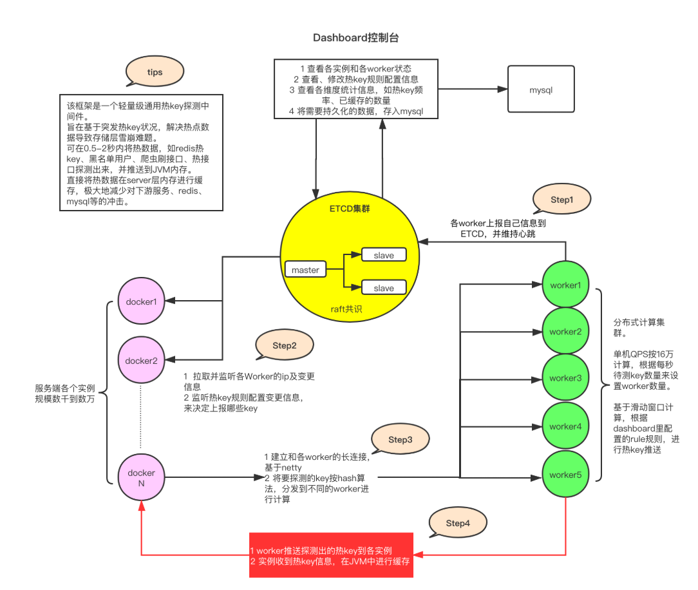

# HotKey
- [HotKey](#hotkey)
  - [介绍](#介绍)
  - [什么是热点](#什么是热点)
  - [如何实现热点探测](#如何实现热点探测)

## 介绍
HotKey 系统是 JD 的高并发解决方案，热点缓存在本地存储，而不只是在 Redis 存储，缓解 Redis 压力。

HotKey 架构: 

## 什么是热点
热点是指一段时间内，被广泛关注的物品或事件。

## 如何实现热点探测
1. 热点规则 配置 HotKey 的上报规则，圈出需要重点监测的 Key
2. 热点上报 应用服务将自己的 HotKey 访问情况上报给集中计算单元
3. 热点统计 收集各应用实例上报的信息，使用滑动窗口算法计算 Key 的热度
4. 热点推送 当 Key 的热度达到阈值时，推送 HotKey 信息到所有应用实例
5. 热点缓存 各应用实例收到 HotKey 信息后，对 Key 的值进行本地缓存
